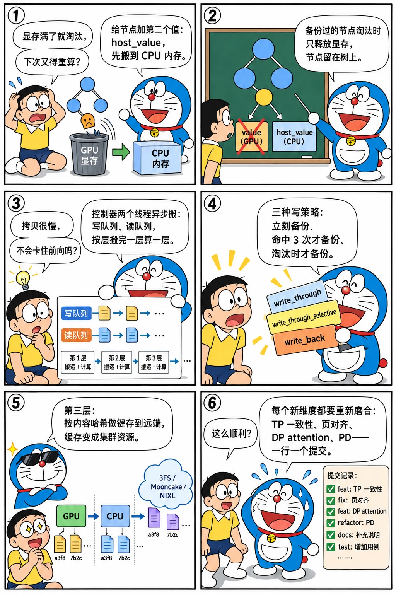

# 分层缓存 HiCache：GPU、CPU 与存储

<p class="lead">基数树只管显存里的 KV；显存满了就淘汰，淘汰了就重算。2025 年 2 月 23 日合入的 #2693 "Hierarchical Caching for SGLang" 给树加了第二层：节点的 KV 可以备份到 CPU 内存（<code>host_value</code>），从显存淘汰后树上还留着它，再次命中时从内存搬回显存而不是重算。半年后又加了第三层：Mooncake、3FS、NIXL 这样的远端存储，让缓存跨实例共享。这一章读 <code>HiRadixCache</code> 和 <code>HiCacheController</code> 的第一版，看"树的节点有两个值"这个小改动怎样撑起三层缓存，以及它与 PD 分离、页大小、TP 的每一次磨合。</p>

!!! question "自测：能答上来就可以跳过本章"
    1. `HiRadixCache` 在 `RadixCache` 之上加了什么状态？淘汰时"备份过的节点"和"没备份的节点"有什么不同？
    2. `HiCacheController` 为什么要有自己的线程？`write_through`、`write_through_selective`、`write_back` 三种写策略各在什么时候把 KV 写到 CPU？
    3. 匹配到一个只在 CPU 上的前缀时会发生什么？`load_back_threshold` 是什么？
    4. 存储层（第三层）是怎么接进来的？为什么节点要带哈希值？

??? success "自测参考答案（先自己答，再展开对照）"
    1. 每个节点多了 `host_value`（CPU 内存池里的位置）和 `backuped` 状态，加一个 CPU 侧的内存池（`MHATokenToKVPoolHost` / `MLATokenToKVPoolHost`，和 GPU 池同布局）。淘汰时备份过的节点只释放显存、节点保留在树上（`_evict_backuped`），没备份的节点整个删除（`_evict_regular`）；CPU 内存满了另有 `evict_host`。
    2. 显存和内存之间的拷贝要走 PCIe，和前向计算异步；控制器用独立的写线程和读线程消费 `TransferBuffer` 队列，按层拷贝并用 `LayerDoneCounter` 让读取可以逐层等待。`write_through`：节点插入时立刻备份；`write_through_selective`：命中次数到阈值（默认 3）才备份，避免只用一次的前缀占内存；`write_back`：只在从显存淘汰时才写到 CPU。
    3. `match_prefix(include_evicted=True)` 会匹配到备份节点；如果命中的 CPU 侧前缀长度超过 `load_back_threshold`（默认 10 个 token），就申请显存、发起 `load_back`，请求等拷贝完成再进入 batch；太短的不值得搬，直接重算。
    4. 2025-07 的 "HiCache Storage Layer Prototype"（#7704）加了 `HiCacheStorage` 接口（get / set / exists），后端有文件、3FS、Mooncake 存储、NIXL 等；节点的 KV 要在实例之间共享，键不能是本地的槽位号，所以插入时按 token 内容算哈希（#9053），哈希就是存储层的键。

先看一个六格小剧场，再读正文：

{.aig-comic}

## 从 PR 号看时间

```bash title="hicache-commits.sh"
for h in 51caee740f 5d6e9467d4 13387e6b7a 6c7a152c5a 10b544ae9b 0e0ec70200 e119f04215 a023856b12 9d33fcfb8e 299803343d 2cd2e27f80 9f78f391ae 8b6966d020 1ccd59c715; do
  git log -1 --date=short --format='%ad  %h  %s' $h | cut -c1-96
done
```

```text title="输出"
2025-01-07  51caee740f  Host memory pool for hierarchical caching (#2771)
2025-01-10  5d6e9467d4  Cache controller for hierarchical caching (#2804)
2025-01-17  13387e6b7a  Multi-turn benchmark for hierarchical caching (#2942)
2025-02-23  6c7a152c5a  Hierarchical Caching for SGLang (#2693)
2025-03-12  10b544ae9b  Hierarchical Caching Refactoring and Fixing TP issue (#4082)
2025-03-14  0e0ec70200  Hierarchical Caching supports MLA (#4009)
2025-04-01  e119f04215  Large page size aligned hierarchical caching (#4581)
2025-06-14  a023856b12  Move host memory pools into a separate file (#7200)
2025-07-18  9d33fcfb8e  Hicache Storage Layer Prototype (#7704)
2025-07-31  299803343d  Add hf3fs support for hicache storage (based on #7704) (#7280)
2025-07-31  2cd2e27f80  SGLang HiCache NIXL Connector (#8488)
2025-08-11  9f78f391ae  HiCache Storage: generate hash when inserting new nodes (#9053)
2025-08-31  8b6966d020  [HiCache] Storage Refactoring (#9797)
2025-09-18  1ccd59c715  [HICache] introduce evict policy (#10190)
```

主 PR #2693 的号是 2024 年 12 月的，合入是 2025 年 2 月 23 日；它依赖的两块先合了：1 月 7 日 #2771 "Host memory pool"（CPU 侧的内存池，和 GPU 池同布局），1 月 10 日 #2804 "Cache controller"（搬运线程），1 月 17 日还先有了多轮对话的基准脚本 #2942——先把度量工具准备好再合功能。这是 2024 Q4 路线图（issue #1487）里"multi-layer radix cache #2693"的落地，v0.4 博客的"下一步"也点了名。

## 树的节点有两个值

v0.4.6 的 `HiRadixCache` 继承 `RadixCache`：

```python title="python/sglang/srt/mem_cache/hiradix_cache.py @ v0.4.6 L23-69" linenums="23"
class HiRadixCache(RadixCache):

    def __init__(
        self,
        req_to_token_pool: ReqToTokenPool,
        token_to_kv_pool_allocator: TokenToKVPoolAllocator,
        tp_cache_group: torch.distributed.ProcessGroup,
        page_size: int,
        hicache_ratio: float,
        hicache_size: int,
        hicache_write_policy: str,
    ):
        self.kv_cache = token_to_kv_pool_allocator.get_kvcache()
        if isinstance(self.kv_cache, MHATokenToKVPool):
            self.token_to_kv_pool_host = MHATokenToKVPoolHost(
                self.kv_cache, hicache_ratio, hicache_size, page_size
            )
        elif isinstance(self.kv_cache, MLATokenToKVPool):
            self.token_to_kv_pool_host = MLATokenToKVPoolHost(
                self.kv_cache, hicache_ratio, hicache_size, page_size
            )
        else:
            raise ValueError(f"HiRadixCache only supports MHA and MLA yet")

        self.tp_group = tp_cache_group

        self.load_cache_event = threading.Event()
        self.cache_controller = HiCacheController(
            token_to_kv_pool_allocator,
            self.token_to_kv_pool_host,
            page_size,
            load_cache_event=self.load_cache_event,
            write_policy=hicache_write_policy,
        )

        # record the nodes with ongoing write through
        self.ongoing_write_through = {}
        # record the node segments with ongoing load back
        self.ongoing_load_back = {}
        # todo: dynamically adjust the threshold
        self.write_through_threshold = (
            1 if hicache_write_policy == "write_through" else 3
        )
        self.load_back_threshold = 10
        super().__init__(
            req_to_token_pool, token_to_kv_pool_allocator, page_size, disable=False
        )
```

初始化做三件事：按 GPU 池的类型建对应的 CPU 池（MHA 或 MLA，大小由 `hicache_ratio` 或 `hicache_size` 决定）、建 `HiCacheController`、设两个阈值（写入阈值按策略 1 或 3，加载阈值 10）。备份一个节点：

```python title="python/sglang/srt/mem_cache/hiradix_cache.py @ v0.4.6 L84-104" linenums="84"
    def write_backup(self, node: TreeNode, write_back=False):
        host_indices = self.cache_controller.write(
            device_indices=node.value,
            node_id=node.id,
        )
        if host_indices is None:
            self.evict_host(len(node.value))
            host_indices = self.cache_controller.write(
                device_indices=node.value,
                node_id=node.id,
            )
        if host_indices is not None:
            node.host_value = host_indices
            self.ongoing_write_through[node.id] = node
            if not write_back:
                # no need to lock nodes if write back
                self.inc_lock_ref(node)
        else:
            return 0

        return len(host_indices)
```

`cache_controller.write` 在 CPU 池里分配位置并把拷贝任务排进队列，分配失败就先 `evict_host` 再试；成功后节点记下 `host_value`，进入 `ongoing_write_through`，并给节点加锁——拷贝没完成之前不能从显存淘汰（`write_back` 模式例外，因为那时节点本来就是在淘汰路径上）。淘汰逻辑分成两条路：

```python title="python/sglang/srt/mem_cache/hiradix_cache.py @ v0.4.6 L154-204" linenums="154"
    def evict(self, num_tokens: int):
        leaves = self._collect_leaves_device()
        heapq.heapify(leaves)

        num_evicted = 0
        write_back_nodes = []
        while num_evicted < num_tokens and len(leaves):
            x = heapq.heappop(leaves)

            if x.lock_ref > 0:
                continue

            if not x.backuped:
                if self.cache_controller.write_policy == "write_back":
                    # write to host if the node is not backuped
                    num_evicted += self.write_backup(x, write_back=True)
                    write_back_nodes.append(x)
                else:
                    num_evicted += self._evict_regular(x)
            else:
                num_evicted += self._evict_backuped(x)

            for child in x.parent.children.values():
                if child in write_back_nodes:
                    continue
                if not child.evicted:
                    break
            else:
                # all children are evicted or no children
                heapq.heappush(leaves, x.parent)

        if self.cache_controller.write_policy == "write_back":
            self.writing_check(write_back=True)
            for node in write_back_nodes:
                assert node.backuped
                self._evict_backuped(node)

    def _evict_backuped(self, node: TreeNode):
        # evict a node already written to host
        num_evicted = self.cache_controller.evict_device(node.value, node.host_value)
        assert num_evicted > 0
        self.evictable_size_ -= num_evicted
        node.value = None
        return num_evicted

    def _evict_regular(self, node: TreeNode):
        # evict a node not initiated write to host
        self.cache_controller.mem_pool_device_allocator.free(node.value)
        num_evicted = len(node.value)
        self._delete_leaf(node)
        return num_evicted
```

叶子 LRU 的框架和[第三章](../origins/radix-v1.md)一样，区别在弹出一个叶子之后：有 `host_value` 的节点只释放显存（`_evict_backuped`），节点留在树上、`value` 置空；没有的才整个删掉（`_evict_regular`）。`write_back` 策略下淘汰时才触发备份。于是树上出现了"只在 CPU 上"的节点，`match_prefix(include_evicted=True)` 能匹配到它们，调度器据此决定要不要 `load_back`。

{.aig-svg}

## 控制器：两个线程、按层搬运

```python title="python/sglang/srt/managers/cache_controller.py @ v0.4.6 L146-200" linenums="146"
class HiCacheController:

    def __init__(
        self,
        token_to_kv_pool_allocator: TokenToKVPoolAllocator,
        mem_pool_host: HostKVCache,
        page_size: int,
        load_cache_event: threading.Event = None,
        write_policy: str = "write_through_selective",
    ):
        self.mem_pool_device_allocator = token_to_kv_pool_allocator
        self.mem_pool_device = token_to_kv_pool_allocator.get_kvcache()
        self.mem_pool_host = mem_pool_host
        self.write_policy = write_policy
        self.page_size = page_size

        self.load_cache_event = load_cache_event
        self.layer_done_counter = LayerDoneCounter(self.mem_pool_device.layer_num)
        self.mem_pool_device.register_layer_transfer_counter(self.layer_done_counter)

        if write_policy not in [
            "write_through",
            "write_through_selective",
            "write_back",
        ]:
            raise ValueError(f"Invalid write policy: {write_policy}")

        self.write_queue = PriorityQueue()
        self.load_queue = PriorityQueue()

        self.ack_write_queue = Queue()
        self.ack_load_queue = Queue()

        self.stop_event = threading.Event()
        self.write_buffer = TransferBuffer(self.stop_event)
        self.load_buffer = TransferBuffer(
            self.stop_event, buffer_count=10, max_buffer_size=100
        )

        self.write_stream = torch.cuda.Stream()
        self.load_stream = torch.cuda.Stream()

        self.write_thread = threading.Thread(
            target=(
                self.write_thread_func_buffer
                if self.page_size == 1
                else self.write_thread_func_direct
            ),
            daemon=True,
        )
        self.load_thread = threading.Thread(
            target=self.load_thread_func_layer_by_layer, daemon=True
        )
        self.write_thread.start()
        self.load_thread.start()
```

`HiCacheController` 持有两个 `TransferBuffer`（写队列、读队列）和两个线程；每个 `CacheOperation` 是"一段设备索引 ↔ 一段主机索引"，可以合并（`merge`）也可以按因子拆分（`split`）成小块以便流水。读取时 `LayerDoneCounter` 让"前 k 层已经搬完"可以被等待——前向按层进行，第一层的 KV 到了就能开始算第一层，不必等全部搬完（后来版本里的"layer-wise load"）。线程用自己的 CUDA 流做 `copy_`，不占前向流。

## 磨合

HiCache 碰到了运行时的每一个部件：

| 时间 | 提交 | 磨合的对象 |
| --- | --- | --- |
| 2025-03-12 | #4082 "Refactoring and Fixing TP issue" | TP 下各 rank 的备份 / 加载决定必须一致（`tp_cache_group` 的同步） |
| 2025-03-14 | #4009 | MLA 的 CPU 池 |
| 2025-03-13 / 04-01 | #4397、#4581 | 页大小大于 1 之后树按页对齐，备份也要按页 |
| 2025-06-20 | #7159 | DP attention + HiCache 挂起 |
| 2025-07-30 | PD + HiCache（#8211 系列） | prefill 实例复用远端存储里的缓存 |
| 2025-09 → 10 | #10190、#11506 | 淘汰策略插件化（LRU、LFU、SLRU…） |

每一行都是"一个新维度 × 已有维度"的组合问题，这也是为什么 2025 年 Q3 的路线图把 `mem_cache` 的重构列为重点。

## 第三层：存储

2025 年 7 月 18 日 #7704 "Hicache Storage Layer Prototype" 定义了 `HiCacheStorage` 接口，7 月 31 日 #7280 加 3FS 后端、#8488 加 NIXL 连接器，8 月前后接入 Mooncake Store；#9053（8 月 11 日）让树节点在插入时计算哈希（按页、链式：每页的哈希包含前一页的哈希），作为跨实例共享的键；#9797（8 月 31 日）重构存储层。看一下今天的后端：

```bash title="hicache-storage.sh"
REF=${REF:-29f6d408c0}
echo "mem_cache/storage/ 下的后端目录："
git ls-tree -r --name-only "$REF" -- python/sglang/srt/mem_cache/storage | sed 's|python/sglang/srt/mem_cache/storage/||' | awk -F/ 'NF > 1 {print $1}' | sort | uniq -c | awk '{printf "   %2d 个文件  %s\n", $1, $2}'
printf 'hiradix_cache.py 行数：v0.4.6 %d，v0.5.0rc0 %d\n' "$(git show v0.4.6:python/sglang/srt/mem_cache/hiradix_cache.py | wc -l)" "$(git show v0.5.0rc0:python/sglang/srt/mem_cache/hiradix_cache.py | wc -l)"
echo "hiradix_cache.py 的最后一个提交：$(git log -1 --date=short --format='%ad %h %s' "$REF" -- python/sglang/srt/mem_cache/hiradix_cache.py | cut -c1-80)"
echo "今天的统一树实现：$(git ls-tree -r --name-only "$REF" -- python/sglang/srt/mem_cache | grep -E 'unified_radix_cache.py|unified_cache/|rust_tree_core/' | wc -l) 个文件（unified_radix_cache.py、unified_cache/、rust_tree_core/）"
```

```text title="输出"
mem_cache/storage/ 下的后端目录：
    3 个文件  aibrix_kvcache
    3 个文件  eic
    2 个文件  file
    7 个文件  flexkv
    9 个文件  hf3fs
    4 个文件  lmcache
    2 个文件  mmap
    5 个文件  mooncake_store
    7 个文件  nixl
    4 个文件  npu_memcache
    2 个文件  shm
    3 个文件  simm
    7 个文件  tensorcast_store
    4 个文件  umbp
hiradix_cache.py 行数：v0.4.6 464，v0.5.0rc0 747
hiradix_cache.py 的最后一个提交：2026-09-22 4ce23542bf [HiCache] Remove the unused HiRadixCache (#40787)
今天的统一树实现：22 个文件（unified_radix_cache.py、unified_cache/、rust_tree_core/）
```

存储层的典型用法：prefill 实例把算好的 KV 写到共享存储，另一台机器上的实例命中同一前缀时从存储预取（`storage_prefetch.py`）；PD 分离下 prefill 节点可以直接复用别的 prefill 节点写进存储的前缀。这把"前缀缓存"从单机资源变成了集群资源——[第 21 章](../platform/gateway.md)的网关据此做跨实例的缓存感知路由。

## 设计取舍

- **扩展节点而不是另建一棵树。** 一个节点两个值（`value` / `host_value`）让匹配、锁、淘汰的逻辑都能复用；代价是 `RadixCache` 的每个方法都要考虑"值为空但节点在"的状态。
- **CPU 池与 GPU 池同布局。** 拷贝是整段 `copy_`，不需要重排；代价是 CPU 内存按 GPU 的槽位粒度管理，不如按请求整段存紧凑。
- **异步线程 + 锁。** 拷贝期间节点加锁而不是复制数据，省内存但延长了节点不可淘汰的时间。
- **三种写策略。** 默认的 `write_through_selective` 用命中次数筛选"值得备份"的前缀，是在内存容量和备份带宽之间的折中。

## 后来怎么样了

- `hiradix_cache.py` 从 464 行长到 v0.5.0rc0 的 747 行；2026 年分层逻辑并入统一的树实现（`unified_radix_cache.py`、`unified_cache/`、Rust 写的 `rust_tree_core/`），2026-09-22 的 #40787 删掉了不再使用的 `HiRadixCache`——上面脚本的最后两行给出这两个事实；旁边还多了 `storage/`、`hicache_storage.py`、`storage_prefetch.py`、`memory_pool_host.py` 等十几个文件；
- 2026 年：`evict_policy.py` 的多种策略、SWA 与混合模型的分层缓存、DeepSeek-V4 的稀疏索引缓存与主机侧池；
- 推理系统手册的 [KV 分层缓存一章](serving://distributed/kv-offload/)从系统角度比较了几种分层方案，这里讲的是它在 SGLang 里的具体形状。

## 练习

**1. 锁的时长。** `write_backup` 对非 write_back 的节点 `inc_lock_ref`，什么时候解锁？拷贝很慢时会对淘汰造成什么影响？

??? success "参考思路"
    `writing_check` 在检查写队列的完成情况时解锁（`ongoing_write_through` 里的节点）；拷贝慢时大量节点处于锁定状态，可淘汰的显存减少，准入会更保守。

**2. 阈值的作用。** `load_back_threshold = 10`：命中 8 个 token 的 CPU 前缀时会怎样？为什么不搬？

??? success "参考答案"
    不搬，当作未命中重算这 8 个 token。搬回要分配显存、排队、等拷贝，8 个 token 的 prefill 比这些开销还小。

**3. 哈希的链式。** 读基准提交的 `radix_cache.py` 里 `hash_value` 的计算，说明为什么页的哈希要包含前一页的哈希，而不是只哈希本页的 token。

??? success "参考思路"
    KV 的内容依赖整个前缀，不只依赖本页的 token；只哈希本页会把不同上下文下的同一段 token 当成同一份 KV。链式哈希让键隐含了完整前缀。

!!! interview "面试怎么答"
    "KV 缓存怎么做多级？"——用 SGLang 的三层讲：树节点带 `host_value`，淘汰时备份过的只释放显存；控制器两个线程按层异步搬运；三种写策略筛选值得备份的前缀；第三层用内容哈希做键接入远端存储，缓存变成集群资源。再提磨合：TP 一致性、页对齐、DP attention、PD——说明多级缓存的难点在和其他机制的组合。

## 小结

- [x] #2693（2025-02-23）：`HiRadixCache` 给节点加 `host_value`，备份过的节点淘汰时只释放显存；`HiCacheController` 两个线程异步搬运，三种写策略。
- [x] 先合内存池和控制器、先有基准脚本，再合主 PR。
- [x] 2025-07 起的存储层用内容哈希做键，缓存从单机资源变成集群资源；每个新维度都要和 TP、页大小、DP、PD 重新磨合。
