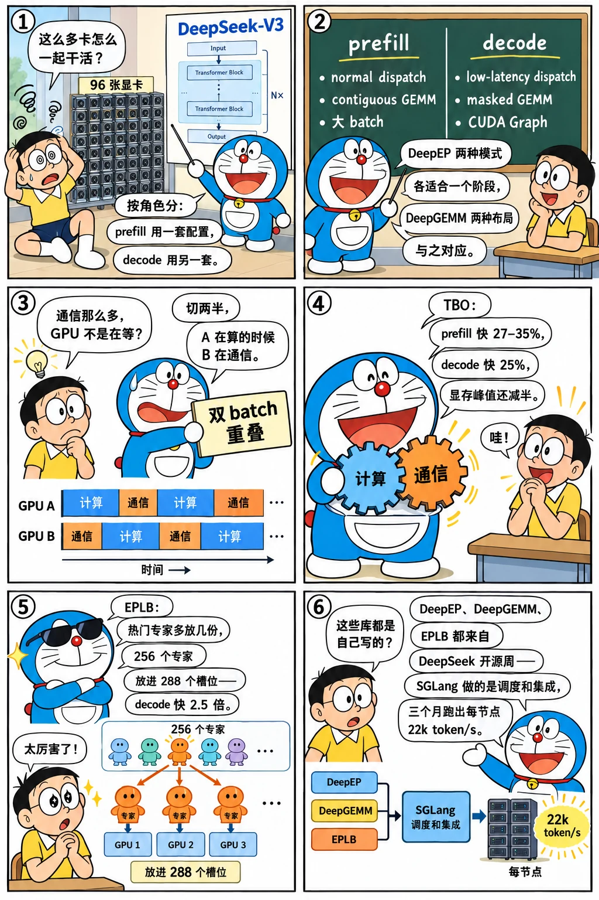

# 大规模 EP：DeepEP、EPLB 与双 batch 重叠

<p class="lead">2025 年 2 月 DeepSeek 开源周放出了 DeepEP、DeepGEMM 和 EPLB，SGLang 在三个月内把它们全部接进来，并在 5 月 5 日用 96 张 H100 复现了 DeepSeek 官方的部署形态：PD 分离、prefill EP32、decode EP72，每节点每秒 52.3k 输入、22.3k 输出 token。这一章讲这三个月的三条线——DeepEP 的两种分发模式怎么对应 prefill 与 decode，双 batch 重叠（TBO）怎样把通信藏到计算后面，EPLB 怎样用冗余专家平衡负载——以及它们在代码里的落点：<code>layers/moe/token_dispatcher/</code>、<code>two_batch_overlap.py</code>、<code>eplb/</code>。</p>

!!! question "自测：能答上来就可以跳过本章"
    1. DeepEP 的 normal 和 low-latency 两种 dispatch 各适合什么阶段？为什么 decode 要用后者？
    2. 双 batch 重叠是怎么做的？它和[第 12 章](../perf/overlap.md)的重叠调度重叠的是同一种东西吗？
    3. EPLB 为什么需要"冗余专家"？静态和动态重平衡各在什么时候做？
    4. 博客里的 1.49 倍、2.54 倍、27–35% 分别是什么的提升？

??? success "自测参考答案（先自己答，再展开对照）"
    1. normal 模式按实际 token 数做 all-to-all，形状是动态的，吞吐高但不能进 CUDA Graph，适合 prefill（输入长、batch 大）；low-latency 模式预先分配固定大小的 RDMA 缓冲区、形状固定、延迟低、支持 CUDA Graph，适合 decode（每步只有少量 token、要靠图回放压低发射开销）。
    2. 把一个 batch 切成两个 micro-batch，交替执行：一个在做注意力 / MLP 计算时，另一个在做 dispatch / combine 通信，让通信和计算重叠。第 12 章重叠的是 CPU 调度与 GPU 计算，这里重叠的是 GPU 上的通信与计算；两者可以同时开。
    3. 专家的负载不均：热门专家所在的卡成为瓶颈。EPLB 按统计到的专家负载重新安排专家到卡的映射，热门专家复制多份（256 个专家扩成 288 个"物理专家"），每份分担一部分流量。静态：启动时按历史分布算一次；动态：运行中周期性重新统计并重平衡（三阶段：加载、异步传权重、设备间拷贝）。
    4. EPLB 开启后 prefill 吞吐 1.49 倍、decode 2.54 倍；TBO 让 prefill 吞吐提高 27–35%、decode（每卡 256 token 时）25.5%。

先看一个六格小剧场，再读正文：

{.aig-comic}

## 三个月的提交

```bash title="large-ep-commits.sh"
for h in 21463e321a c553e1604c f44db16c8e 4c56e5dbee ca75741e86 23c764b18a febe21ce03 77e929a1a2 f0653886a5 cba1cdbc46 ccfe5c009d 7a80f56513 0d47788025 32fa1e9cc2; do
  git log -1 --date=short --format='%ad  %h  %s' $h | cut -c1-96
done
```

```text title="输出"
2025-02-26  21463e321a  Expert Parallelism (EP) Support for DeepSeek V3/R1 (#3602)
2025-03-10  c553e1604c  DeepGemm integrate to sgl-kernel (#4165)
2025-03-19  f44db16c8e  [Feature] Integrate DeepEP into SGLang (#4232)
2025-03-21  4c56e5dbee  Set deepgemm to the default value in the hopper architecture. (#4613)
2025-03-23  ca75741e86  Support async in DeepEP (#4610)
2025-04-02  23c764b18a  [Feature] Support DeepEP Low Latency (#4767)
2025-04-04  febe21ce03  Small refactor DeepEPDispatcher into subclasses (#4994)
2025-04-04  77e929a1a2  Support async DeepEP by splitting into two stages (#4995)
2025-05-20  f0653886a5  Expert distribution recording without overhead for EPLB (#4957)
2025-05-20  cba1cdbc46  Support DeepSeek EPLB algorithm with static distributions (#6387)
2025-05-21  ccfe5c009d  Support redundant experts in expert parallel (#6461)
2025-05-22  7a80f56513  Support dynamically rebalancing experts using EPLB (#6469)
2025-05-25  0d47788025  Support overlapping two batches (#4068)
2025-07-31  32fa1e9cc2  [4/N] MoE Refactor: Unified Triton Kernel for FusedMoE and EPMoE (#8515)
```

2 月 26 日 #3602 先让 DeepSeek-V3 / R1 能跑 EP（[第 13 章](../perf/multi-gpu.md)的朴素 EP 加上 MoE 的权重切分）；3 月 10 日 DeepGEMM 进 sgl-kernel，3 月 19 日 #4232 接入 DeepEP，4 月 2 日 #4767 支持 low-latency 模式，4 月初一组重构（`DeepEPMode`、`DeepEPDispatcher` 子类化、异步两阶段）；5 月 20 日起 EPLB 系列（统计、静态分布、冗余专家、动态重平衡）；5 月 25 日 #4068 TBO。再看目录：

```bash title="moe-dirs.sh"
REF=${REF:-29f6d408c0}
for t in v0.4.0 v0.4.6 v0.5.0rc0 "$REF"; do
  printf '%-11s layers/moe %3d 个文件，eplb %2d 个，two_batch_overlap.py %4d 行\n' "$t" "$(git ls-tree -r --name-only "$t" -- python/sglang/srt/layers/moe | grep -c '\.py$')" "$(git ls-tree -r --name-only "$t" -- python/sglang/srt/eplb | grep -c '\.py$')" "$(git show "$t:python/sglang/srt/two_batch_overlap.py" 2>/dev/null | wc -l)"
done
echo "今天 batch_overlap/：$(git ls-tree -r --name-only "$REF" -- python/sglang/srt/batch_overlap | sed 's|.*/||' | tr '\n' ' ')"
```

```text title="输出"
v0.4.0      layers/moe   0 个文件，eplb  0 个，two_batch_overlap.py    0 行
v0.4.6      layers/moe  10 个文件，eplb  0 个，two_batch_overlap.py    0 行
v0.5.0rc0   layers/moe  18 个文件，eplb 11 个，two_batch_overlap.py  980 行
29f6d408c0  layers/moe  64 个文件，eplb 14 个，two_batch_overlap.py    0 行
今天 batch_overlap/：operations.py operations_strategy.py single_batch_overlap.py two_batch_overlap.py 
```

## DeepEP：两种模式各用其所

v0.5.0rc0 的分发器把两种模式封装成同一个接口：

```python title="python/sglang/srt/layers/moe/token_dispatcher/deepep.py @ v0.5.0rc0 L87-151" linenums="87"
class DeepEPDispatchMode(IntEnum):
    NORMAL = auto()
    LOW_LATENCY = auto()


class DeepEPBuffer:
    _buffer = None
    _dispatch_mode: Optional[DeepEPDispatchMode] = None
    _hidden_size: Optional[int] = None
    _num_max_dispatch_tokens_per_rank: Optional[int] = None
    _num_experts: Optional[int] = None

    @classmethod
    def get_deepep_buffer(
        cls,
        group: dist.ProcessGroup,
        hidden_size: int,
        param_bytes: int,
        deepep_mode: DeepEPMode,
        num_max_dispatch_tokens_per_rank: int = None,
        num_experts: int = None,
    ):
        if cls._buffer is not None:
            return cls._buffer

        cls._hidden_size = hidden_size
        cls._num_max_dispatch_tokens_per_rank = num_max_dispatch_tokens_per_rank
        cls._num_experts = num_experts

        num_nvl_bytes, num_rdma_bytes = 0, 0
        if deepep_mode.enable_normal():
            hidden_bytes = hidden_size * param_bytes
            for config in (
                DeepEPConfig.get_instance().normal_dispatch_config
                or Buffer.get_dispatch_config(group.size()),
                DeepEPConfig.get_instance().normal_combine_config
                or Buffer.get_combine_config(group.size()),
            ):
                num_nvl_bytes = max(
                    config.get_nvl_buffer_size_hint(hidden_bytes, group.size()),
                    num_nvl_bytes,
                )
                num_rdma_bytes = max(
                    config.get_rdma_buffer_size_hint(hidden_bytes, group.size()),
                    num_rdma_bytes,
                )
        if deepep_mode.enable_low_latency():
            assert num_max_dispatch_tokens_per_rank is not None
            assert num_experts is not None and num_experts % group.size() == 0
            num_rdma_bytes = max(
                Buffer.get_low_latency_rdma_size_hint(
                    num_max_dispatch_tokens_per_rank,
                    hidden_size,
                    group.size(),
                    num_experts,
                ),
                num_rdma_bytes,
            )

        if deepep_mode == DeepEPMode.NORMAL:
            num_qps_per_rank = DeepEPConfig.get_instance().num_sms // 2
        elif deepep_mode in [DeepEPMode.LOW_LATENCY, DeepEPMode.AUTO]:
            num_qps_per_rank = num_experts // group.size()
        else:
            raise NotImplementedError
```

`DeepEPBuffer` 按模式分配通信缓冲区：normal 模式需要 NVLink 和 RDMA 的缓冲区（节点内外两级），low-latency 模式用 `get_low_latency_rdma_size_hint` 按最大 token 数、隐藏层大小、专家数预分配固定大小的 RDMA 缓冲区。`DeepEPMode.AUTO` 在 prefill 时用 normal、decode 时用 low-latency——这正是博客里"PD 分离让两种模式同时存在"的实现：同一个服务器里两种模式要共用显存和缓冲区，分开部署后各自只保留一种。DeepGEMM 的两种 kernel 与之对应：contiguous 布局处理 normal 分发后的动态形状（需要一个 Triton 的 permute kernel 把 token 按专家排好），masked 布局处理 low-latency 的固定形状（用掩码标出有效 token），后者可以进 CUDA Graph。

{.aig-svg}

## TBO：通信藏到计算后面

`two_batch_overlap.py` 在 v0.5.0rc0 有 980 行。核心是把一个 batch 切成两半：

```python title="python/sglang/srt/two_batch_overlap.py @ v0.5.0rc0 L42-75" linenums="42"
def get_token_num_per_seq(
    forward_mode: ForwardMode,
    spec_info: Optional[Union[EagleDraftInput, EagleVerifyInput]] = None,
):
    if forward_mode.is_target_verify():
        return spec_info.draft_token_num
    elif forward_mode.is_decode():
        return 1
    elif forward_mode.is_idle():
        return 0
    else:
        # For extend, we should not use `token_num_per_seq`.
        return None


# TODO: may smartly disable TBO when batch size is too small b/c it will slow down
def compute_split_seq_index(
    forward_mode: "ForwardMode",
    num_tokens: int,
    extend_lens: Optional[Sequence[int]],
    token_num_per_seq: Optional[int],
) -> Optional[int]:
    if forward_mode == ForwardMode.EXTEND:
        assert extend_lens is not None
        return _split_extend_seqs(extend_lens)
    elif forward_mode.is_target_verify() or forward_mode.is_decode():
        assert token_num_per_seq is not None
        return (num_tokens // token_num_per_seq) // 2
    elif forward_mode.is_idle():
        assert num_tokens == 0
        return 0
    else:
        raise NotImplementedError()

```

切分点按 token 数平衡（prefill 按序列累计长度切，decode 按请求数对半），`TboForwardBatchPreparer` 从一个 `ForwardBatch` 派生出两个子 batch（各自的注意力元数据、位置、槽位），`TboCudaGraphRunnerPlugin` 处理 CUDA Graph 下的切分（捕获时按固定比例切），`TboDPAttentionPreparer` 让 DP attention 的各 rank 对"是否启用 TBO、怎么切"达成一致。模型侧用"操作 + yield 点"的写法：每一层拆成 attention、dispatch、MLP、combine 几个阶段，两个 micro-batch 的阶段交错执行——A 在算注意力时 B 在做 dispatch 通信。博客给的数字：prefill 吞吐 27–35%，decode 在每卡 256 token 时 25.5%；另一个好处是峰值显存减半（每次只有半个 batch 的激活）。prefill 还有一个发射顺序的优化：先把 GPU 计算提交出去，再做会阻塞 CPU 的 dispatch 调用，避免 GPU 空等。

## EPLB：冗余专家与重平衡

```bash title="eplb-files.sh"
REF=${REF:-29f6d408c0}
for f in $(git ls-tree -r --name-only v0.5.0rc0 -- python/sglang/srt/eplb | grep '\.py$'); do printf '%5d  %s\n' "$(git show "v0.5.0rc0:$f" | wc -l)" "${f#python/sglang/srt/}"; done
echo "今天：$(git ls-tree -r --name-only "$REF" -- python/sglang/srt/eplb | grep -c '\.py$') 个文件"
```

```text title="输出"
    0  eplb/__init__.py
   63  eplb/eplb_algorithms/__init__.py
  223  eplb/eplb_algorithms/deepseek.py
  276  eplb/eplb_algorithms/deepseek_vec.py
   94  eplb/eplb_manager.py
    1  eplb/eplb_simulator/__init__.py
   51  eplb/eplb_simulator/reader.py
  927  eplb/expert_distribution.py
  463  eplb/expert_location.py
  109  eplb/expert_location_dispatch.py
  575  eplb/expert_location_updater.py
今天：14 个文件
```

EPLB 的三块：`expert_distribution.py` 记录每个专家被路由到的 token 数（#4957 做到了"无开销"记录：在 kernel 侧累加），`eplb_algorithms/deepseek.py` 是 DeepSeek 开源的分配算法（分层：先按节点分组再在组内分配，让一个节点内的专家尽量来自同一组），`eplb_manager.py` 负责在运行中触发重平衡：统计到的分布 → 新的专家到卡映射 → 异步地把权重搬到目标卡 → 设备间拷贝切换。冗余专家（#6461）让物理专家数不必等于逻辑专家数：256 个逻辑专家放到 288 个槽位里，热门的多放几份。博客的案例研究显示负载均衡度（平均 / 最大）和吞吐强相关，这是 EPLB 的 1.49 倍 / 2.54 倍的来源。

## 设计取舍

- **接 DeepSeek 的三个库而不是自研。** DeepEP、DeepGEMM、EPLB 算法都是直接接入（DeepGEMM 走 sgl-kernel，EPLB 算法复制到 `eplb_algorithms/`），SGLang 做的是调度与集成——与[第八章](../service/borrow-vllm.md)"借用 → 自有"的曲线不同，这次是"集成 + 自己做运行时"。
- **TBO 做在 ForwardBatch 这一层。** 不改模型的计算图，只改"怎么切 batch、怎么交错阶段"；代价是 980 行的切分逻辑要和注意力元数据、CUDA Graph、DP attention、投机解码逐一兼容。
- **PD 分离作为前提。** 两种 DeepEP 模式、两种 DeepGEMM 布局、不同的 EP 大小都按角色分开配置；统一部署做不到这些。

## 后来怎么样了

- 2025-07-31 #8515 "Unified Triton Kernel for FusedMoE and EPMoE" 统一了两套 MoE 的 kernel 路径；`layers/moe/` 到基准提交有上百个文件（CUTLASS MoE、W4A8、各家硬件的 fused MoE）；
- `two_batch_overlap.py` 2025 下半年搬进 `batch_overlap/` 目录，和投机解码、PD decode 侧的重叠整合；
- 2025-10 弹性 EP（#11837，路线图 #7736）：EP 组可以在运行中增减卡，`elastic_ep/` 目录；
- 博客列的局限（TTFT 2–5 秒、ITL 约 100 ms、MTP 与 DP attention 的兼容、Blackwell 支持）在之后的版本里逐项推进。

## 练习

**1. 缓冲区的大小。** 读 v0.5.0rc0 `DeepEPBuffer.get_deepep_buffer`，说明 low-latency 模式的 RDMA 缓冲区由哪些参数决定，为什么 normal 模式不需要预先知道 token 数。

??? success "参考思路"
    `get_low_latency_rdma_size_hint(num_max_dispatch_tokens_per_rank, hidden, num_ranks, num_experts)`：按每 rank 最大 token 数预留；normal 模式按实际 token 数在每次 dispatch 时交换形状。

**2. 切分点。** `compute_split_seq_index` 对 prefill 怎么切？两个 micro-batch 的 token 数会相等吗？

??? success "参考思路"
    按序列的累计 token 数找最接近一半的位置（`_split_array_by_balanced_sum`），不拆分序列，所以两半通常不完全相等；decode 按请求数对半。

**3. 验证博客的数字。** 在 `benchmark/` 里找到 DeepSeek 大规模 EP 的压测脚本或配置，列出复现博客需要的参数（EP 大小、DeepEP 模式、TBO、EPLB、MTP）。

??? success "参考思路"
    `git ls-tree -r --name-only 29f6d408c0 benchmark/ | grep -i 'deepseek\|disagg\|ep'`，读 README 里的启动命令。

!!! interview "面试怎么答"
    "DeepSeek-V3 怎么高吞吐部署？"——按角色答：PD 分离，prefill 用 normal dispatch + contiguous GEMM + 大 EP，decode 用 low-latency dispatch + masked GEMM + CUDA Graph；TBO 把 dispatch / combine 藏在另一个 micro-batch 的计算后面；EPLB 用冗余专家平衡负载。给出博客的数字（每节点 52.3k / 22.3k，$0.20 / M）和它们的来源（EPLB 1.49× / 2.54×，TBO 27–35%）。再提一句 SGLang 的做法是"接入 DeepSeek 开源的三个库 + 自己做调度与集成"。

## 小结

- [x] 2025-02 → 05：EP 支持 → DeepGEMM → DeepEP（normal / low-latency）→ EPLB → TBO，5 月 5 日 96 卡博客。
- [x] 两种 dispatch 模式、两种 GEMM 布局按 prefill / decode 角色分开，PD 分离是前提。
- [x] TBO 在 ForwardBatch 层切两个 micro-batch 交错执行；EPLB 用统计 + 冗余专家 + 动态重平衡。
