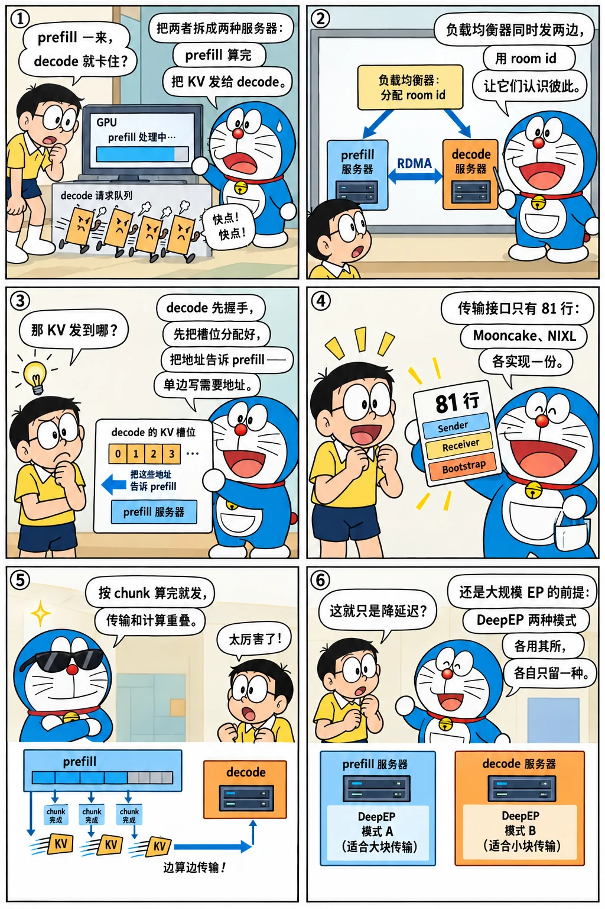

# PD 分离：disaggregation 目录的设计

<p class="lead">prefill 和 decode 的算力需求不同：前者是大矩阵乘，后者是读带宽；放在一张卡上互相干扰，prefill 一来 decode 的延迟就抖。2025 年 3 月 21 日 Byron Hsu 的 #4654 "[PD] Release initial code" 用 1410 行把两者拆成两种服务器：prefill 算完把 KV 通过 RDMA 发给 decode 服务器。这一章读这 1410 行的结构——一个 81 行的传输接口、两个各带队列的调度循环 mixin、一个几百行的 Python 负载均衡器——再看它在一个月内接上 Mooncake、NIXL、重叠调度、DP attention 和 DeepEP 的过程。</p>

!!! question "自测：能答上来就可以跳过本章"
    1. 一个请求在 PD 分离下的完整路径是什么？prefill 和 decode 服务器各维护哪些队列？
    2. `BaseKVSender` / `BaseKVReceiver` / `BaseKVBootstrapServer` 各负责什么？为什么要有 bootstrap？
    3. decode 服务器为什么要"预分配"？`DecodePreallocQueue` 和 `DecodeTransferQueue` 的顺序为什么不能反？
    4. 博客说 PD 分离解决了哪三个问题？

??? success "自测参考答案（先自己答，再展开对照）"
    1. 客户端的请求先到负载均衡器（初版是 `mini_lb.py`），它选一对 prefill / decode 服务器，给请求分配一个 bootstrap room id，同时发给两边。prefill 侧：`PrefillBootstrapQueue`（等 decode 侧握手完成）→ 正常的 prefill 调度 → 每算完一块就 `send_kv_chunk` → 发完进 inflight 队列等传输结束。decode 侧：`DecodePreallocQueue`（握手、预分配 KV 槽位）→ `DecodeTransferQueue`（等 KV 传到）→ "预构建的 extend"（把请求状态设成已 prefill）→ 进入普通的 decode 循环。
    2. sender 在 prefill 侧，`init` 时告诉对端 KV 的槽位数，`send` 时把 KV 索引交给传输引擎，`poll` 查进度；receiver 在 decode 侧，`init` 时报告自己预分配的槽位，`poll` 等数据到齐；bootstrap server 是一个小 HTTP 服务，让两边用 room id 找到彼此、交换 RDMA 地址等元信息——没有它，prefill 不知道该把 KV 发到哪台机器的哪些槽位。
    3. 传输是 RDMA 单边写，发送方需要知道接收方的目标地址，所以 decode 侧必须先把槽位分配好、把地址告诉 prefill 侧，prefill 才能开始发；传输完成后才能进 batch。先传输后分配做不到，因为没有地址。
    4. prefill 打断 decode（decode 的 ITL 抖动）、DP attention 下各 rank 的 prefill / decode 比例失衡、DeepEP 的两种模式（normal 适合 prefill、low-latency 适合 decode）不能在同一个服务器里同时用。

先看一个六格小剧场，再读正文：

{.aig-comic}

## 1410 行的结构

```bash title="pd-initial.sh"
git show --stat=100 --format='%ad  %an  %s' --date=short c7c7dbebbe | grep -v '^$' | cut -c1-96
```

```text title="输出"
2025-03-21  Byron Hsu  [PD] Release initial code (#4654)
 python/sglang/srt/disaggregation/conn.py        |  81 ++++++++
 python/sglang/srt/disaggregation/decode.py      | 495 +++++++++++++++++++++++++++++++++++++++++
 python/sglang/srt/disaggregation/mini_lb.py     | 285 +++++++++++++++++++++++++
 python/sglang/srt/disaggregation/prefill.py     | 249 ++++++++++++++++++++++
 python/sglang/srt/disaggregation/utils.py       |  44 ++++
 python/sglang/srt/managers/schedule_batch.py    |  22 +-
 python/sglang/srt/managers/scheduler.py         | 187 ++++++++++++++++-
 python/sglang/srt/managers/tokenizer_manager.py |  12 ++
 python/sglang/srt/mem_cache/memory_pool.py      |  13 ++
 python/sglang/srt/server_args.py                |  31 +++
 10 files changed, 1410 insertions(+), 9 deletions(-)
```

五个新文件、四处改动：`conn.py` 是传输接口，`prefill.py` 和 `decode.py` 各是一组 mixin（混进 `Scheduler` 和 `ScheduleBatch`），`mini_lb.py` 是负载均衡器，`scheduler.py` 加了 187 行把 mixin 接上。三周后 #5328 "Add transfer backend abstraction" 把 `conn.py` 挪进 `base/`，Mooncake（#4880，4 月 10 日）和 NIXL（#5477，4 月 21 日）各是一个子目录。v0.4.6 的接口：

```python title="python/sglang/srt/disaggregation/base/conn.py @ v0.4.6 L31-113" linenums="31"
class BaseKVManager(ABC):
    """Base class for managing transfers states"""

    @abstractmethod
    def __init__(
        self,
        args: KVArgs,
        disaggregation_mode: DisaggregationMode,
        server_args: ServerArgs,
    ): ...


class BaseKVSender(ABC):

    @abstractmethod
    def __init__(
        self, mgr: BaseKVManager, bootstrap_addr: str, bootstrap_room: int
    ): ...

    @abstractmethod
    def init(self, num_kv_indices: int, aux_index: Optional[int] = None):
        """
        Notify the decoder server about the kv indices length and aux index
        """
        ...

    @abstractmethod
    def send(self, kv_indices: npt.NDArray[np.int64]):
        """
        Send the kv cache at the given kv indices to the decoder server
        """
        ...

    @abstractmethod
    def poll(self) -> KVPoll:
        """
        Check the status of the kv cache transfer
        """
        ...

    @abstractmethod
    def failure_exception(self):
        """
        Raise an exception if the kv cache transfer fails
        """
        ...


class BaseKVReceiver(ABC):

    @abstractmethod
    def __init__(
        self,
        mgr: BaseKVManager,
        bootstrap_addr: str,
        bootstrap_room: Optional[int] = None,
    ): ...

    @abstractmethod
    def init(self, kv_indices: npt.NDArray[np.int64], aux_index: Optional[int] = None):
        """
        Notify the prefill server about the kv indices and aux index
        """
        ...

    @abstractmethod
    def poll(self) -> KVPoll:
        """
        Check the status of the kv cache transfer
        """
        ...

    @abstractmethod
    def failure_exception(self):
        """
        Raise an exception if the kv cache transfer fails
        """
        ...


class BaseKVBootstrapServer(ABC):
    @abstractmethod
    def __init__(self, port: int): ...
```

四个抽象类加起来 80 行：manager 持有传输引擎，sender / receiver 各三个方法（`init`、`send` 或等待、`poll`），bootstrap server 只有端口。所有传输后端都实现这一组接口——这是去年注意力后端抽象（[第 10 章](../perf/restructure.md)）的同一种做法。

{.aig-svg}

## 两个调度循环

prefill 侧的循环：

```python title="python/sglang/srt/disaggregation/prefill.py @ v0.4.6 L179-215" linenums="179"
    def event_loop_normal_disagg_prefill(self: Scheduler):
        """A normal scheduler loop for prefill worker in disaggregation mode."""

        while True:
            recv_reqs = self.recv_requests()
            self.process_input_requests(recv_reqs)
            self.waiting_queue.extend(
                self.disagg_prefill_bootstrap_queue.pop_bootstrapped()
            )
            self.process_prefill_chunk()
            batch = self.get_new_batch_prefill()

            # Handle DP attention
            if (
                self.server_args.enable_dp_attention
                or self.server_args.enable_sp_layernorm
            ):
                batch, _ = self.prepare_dp_attn_batch(batch)

            self.cur_batch = batch

            if batch:
                result = self.run_batch(batch)
                self.process_batch_result_disagg_prefill(batch, result)

            if len(self.disagg_prefill_inflight_queue) > 0:
                self.process_disagg_prefill_inflight_queue()

            if batch is None and len(self.disagg_prefill_inflight_queue) == 0:
                self.check_memory()
                self.new_token_ratio = self.init_new_token_ratio

            self.last_batch = batch
            # HACK (byronhsu): reset the batch_is_full flag because we never enter update_running_batch which resets it
            # Otherwise, it hangs under high concurrency
            self.running_batch.batch_is_full = False

```

和普通循环的差别只有三处：收到的请求先进 `PrefillBootstrapQueue`，握手完成（decode 侧已经预分配）的才 `pop_bootstrapped` 进等待队列；`process_batch_result_disagg_prefill` 在每个 chunk 算完后立刻 `send_kv_chunk`——分块 prefill 的块成了传输的单位，不必等整个 prompt 算完；发完的请求进 inflight 队列，`process_disagg_prefill_inflight_queue` 轮询传输完成后才释放它的 KV。decode 侧：

```python title="python/sglang/srt/disaggregation/decode.py @ v0.4.6 L457-498" linenums="457"
    def event_loop_normal_disagg_decode(self: Scheduler):
        """A normal scheduler loop for decode worker in disaggregation mode."""

        while True:
            recv_reqs = self.recv_requests()
            self.process_input_requests(recv_reqs)
            # polling and allocating kv cache
            self.process_decode_queue()
            batch = self.get_next_disagg_decode_batch_to_run()
            self.cur_batch = batch

            prepare_dp_attn_flag = (
                self.server_args.enable_dp_attention
                or self.server_args.enable_sp_layernorm
            )

            if batch:
                # Generate fake extend output.
                if batch.forward_mode.is_extend():
                    # Note: Logprobs should be handled on the prefill engine.
                    self.stream_output(batch.reqs, False)
                    if prepare_dp_attn_flag:
                        self._prepare_idle_batch_and_run(None)
                else:
                    if prepare_dp_attn_flag:
                        self.prepare_dp_attn_batch(batch)
                    result = self.run_batch(batch)
                    self.process_batch_result(batch, result)
            elif prepare_dp_attn_flag:
                batch, _ = self._prepare_idle_batch_and_run(None)

            if batch is None and (
                len(self.disagg_decode_transfer_queue.queue)
                + len(self.disagg_decode_prealloc_queue.queue)
                == 0
            ):
                # When the server is idle, do self-check and re-init some states
                self.check_memory()
                self.new_token_ratio = self.init_new_token_ratio

            self.last_batch = batch

```

`process_decode_queue` 推动两个队列：`DecodePreallocQueue` 对新请求握手、按 `_allocatable_tokens` 预分配整段 KV（包括 prompt 和将要生成的部分），把地址告诉对端；`DecodeTransferQueue` 轮询 receiver，传完的请求通过 `get_new_prebuilt_batch` 做一次"预构建的 extend"——不真正前向，只把请求的状态设成"prefill 已完成、最后一个 token 已知"，然后像普通请求一样进入 decode。初版的 `event_loop_overlap_disagg_decode` 当天就有，但真正和重叠调度打通是 4 月 21 日的 #5608 / #5609。

## 一个月接上所有东西

```bash title="pd-commits.sh"
for h in c7c7dbebbe 6d3b35fae9 4c31ae9f6d a9499885e9 ab4b5606e4 4dce1cc608 e65b9f21e3 bf98d2e377 711efe7814 e0673969b9 3f57b00a59; do
  git log -1 --date=short --format='%ad  %h  %s' $h | cut -c1-96
done
```

```text title="输出"
2025-03-21  c7c7dbebbe  [PD] Release initial code (#4654)
2025-04-08  6d3b35fae9  [PD] Simplify mini LB (#4911)
2025-04-10  4c31ae9f6d  [PD] Support KV transfer with mooncake (#4880)
2025-04-13  a9499885e9  [PD] Add transfer backend abstraction (#5328)
2025-04-19  ab4b5606e4  [PD] Support page size > 1 (#5561)
2025-04-21  4dce1cc608  [PD] Add NIXL transfer backend  (#5477)
2025-04-21  e65b9f21e3  [PD] Support decode overlap schedule (#5608)
2025-04-21  bf98d2e377  [PD] Support prefill overlap + Ensure no race condition (#5609)
2025-04-23  711efe7814  Integrating PD disaggregation with DP attention and DeepEP (#5435)
2025-04-23  e0673969b9  [PD] Add support for dp attention with mooncake (#5530)
2025-04-21  3f57b00a59  Support PD bootstrap fields on /v1/chat/completions endpoint (#5488)
```

从 3 月 21 日到 4 月 23 日：Mooncake 传输引擎（RDMA 的分散写）、传输后端抽象、页大小大于 1、NIXL、decode / prefill 的重叠调度、DP attention + DeepEP 的集成、OpenAI 接口上的 bootstrap 字段。5 月 5 日的博客就是在这个基础上写的：96 张 H100 上 DeepSeek-V3，prefill 用 4 个节点（EP32）、decode 用 9 个节点（EP72），每节点每秒 52.3k 输入、22.3k 输出 token，输出成本 $0.20 / 百万 token。博客列的三个动机——prefill 打断 decode、DP attention 的失衡、DeepEP 两种模式不能共存——正是 PD 分离在 SGLang 里的定位：它不只是延迟优化，更是大规模 EP 部署的前提（[下一章](large-ep.md)）。

## 设计取舍

- **传输用单边 RDMA 写，所以 decode 先分配。** 接收方不参与数据面，发送方按地址直接写；代价是 decode 侧要为还没到的请求预留完整的 KV（包括未来的输出），显存利用率低于按需分配。
- **按 chunk 发送。** prefill 的每个 chunk 算完就发，传输和计算重叠；代价是请求在 prefill 侧要等所有 chunk 的传输都完成才能释放。
- **mixin 而不是子类。** `SchedulerDisaggregationPrefillMixin` 混进同一个 `Scheduler`，一份代码按 `--disaggregation-mode` 走不同循环；代价是 `Scheduler` 的方法数量膨胀。
- **先用 Python 的 mini_lb。** 285 行的负载均衡器只做轮询和 bootstrap 转发，够跑通；真正的 PD 路由（KV 感知、预填充 / 解码配比）后来放进 Rust 路由器（2025-05 起的 "PD Router" 系列，[第 21 章](../platform/gateway.md)）。

## 后来怎么样了

```bash title="pd-dir.sh"
REF=${REF:-29f6d408c0}
for t in v0.4.6 v0.5.0rc0 "$REF"; do
  printf '%-11s %3d 个文件：' "$t" "$(git ls-tree -r --name-only "$t" -- python/sglang/srt/disaggregation | grep -c '\.py$')"
  git ls-tree -r --name-only "$t" -- python/sglang/srt/disaggregation | sed 's|python/sglang/srt/disaggregation/||' | awk -F/ '{print (NF > 1 ? $1 "/" : $1)}' | sort -u | tr '\n' ' ' | cut -c1-130; echo
done
```

```text title="输出"
v0.4.6       11 个文件：base/ decode.py mini_lb.py mooncake/ nixl/ prefill.py utils.py 

v0.5.0rc0    22 个文件：ascend/ base/ common/ decode.py decode_schedule_batch_mixin.py fake/ kv_events.py launch_lb.py mini_lb.py mooncake/ nixl/ prefill.

29f6d408c0   36 个文件：ascend/ base/ checksum.py common/ decode.py decode_hicache_mixin.py decode_kvcache_offload_manager.py decode_schedule_batch_mixin.
```

- 传输后端从 Mooncake、NIXL 扩展到 Ascend、AMD 的 MoRI、测试用的 fake，`common/` 里是共享的暂存缓冲与打包逻辑；
- `decode_kvcache_offload_manager.py`、`decode_hicache_mixin.py`：decode 侧的 KV 可以卸载，并和 HiCache 的存储层联动（prefill 实例复用远端缓存）；
- `encoder/`：2025 下半年把多模态的视觉编码也拆成独立服务（E/P/D 三段）；
- `role_switch.py`：实例可以在 prefill 与 decode 角色之间切换，为弹性调度准备；
- 2025 Q3 路线图里的 "PD CPU transfer #8210"、PD 与投机解码、PD 与 HiCache 都已落地。

## 练习

**1. 预分配的数量。** 读 v0.4.6 `DecodePreallocQueue._allocatable_tokens` 和 `_pre_alloc`，说明 decode 侧为一个请求预留多少槽位，以及这和[第二章](../origins/first-commit.md)的 `new_token_ratio` 估计有什么关系。

??? success "参考思路"
    预留 `len(prompt) + max_new_tokens`（页对齐）；因为 KV 要先有地址才能接收，不能像普通准入那样按估计系数预留一部分，所以 decode 侧的准入比普通模式更保守。

**2. 握手的内容。** 用 `git show v0.4.6:python/sglang/srt/disaggregation/mooncake/conn.py | grep -n 'def '` 看 Mooncake 后端的 sender / receiver 实现，列出握手时交换的字段。

??? success "参考思路"
    会话 id、接收方的 RDMA 地址与 rkey、KV 池的基地址与每层的偏移、预分配的槽位索引、辅助数据（最后一个 token 等）的位置。

**3. 三个动机验证。** 博客说 DeepEP 的 normal 模式适合 prefill、low-latency 适合 decode。在基准提交里找到 `DeepEPMode.AUTO` 的处理逻辑，说明 PD 分离下它怎么按角色选模式。

??? success "参考思路"
    `git grep -n 'DeepEPMode' 29f6d408c0 -- python/sglang/srt/layers/moe` 找到按 `forward_mode` 或 `disaggregation_mode` 选择 normal / low_latency 的分支。

!!! interview "怎么讲清楚"
    "PD 分离怎么实现？"——按数据流讲：负载均衡器分配 room id 同时发两边；decode 侧先握手、预分配整段 KV 并把地址告诉 prefill；prefill 按 chunk 算完就用 RDMA 单边写发过去；传完 decode 侧做一次"预构建 extend"进入普通循环。然后讲抽象：81 行的 sender / receiver / bootstrap 接口让 Mooncake、NIXL 等后端可插拔。最后讲动机：不只是延迟隔离，也是让 DeepEP 两种模式各用其所的前提。

## 小结

- [x] #4654（2025-03-21）：1410 行，传输接口 + prefill / decode 两组 mixin + mini_lb；三周后抽出传输后端目录。
- [x] decode 先握手预分配、prefill 按 chunk 单边写、传完做预构建 extend；一个月内接上 Mooncake、NIXL、重叠调度、DP attention、DeepEP。
- [x] 博客的三个动机把 PD 分离定位为大规模 EP 的前提；后来扩展到更多传输后端、KV 卸载、编码器分离与角色切换。
