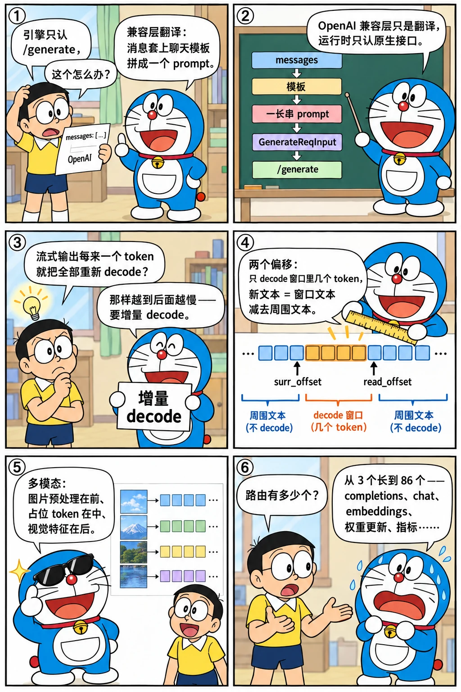

# 服务化：OpenAI 兼容接口、流式输出与多模态

<p class="lead">初版的 HTTP 服务只有三个路由，<code>/v1/completions</code> 是一个 14 行的壳。半年之后它有了完整的 OpenAI 兼容层、聊天模板、增量反分词和多种视觉模型。这一章讲"研究原型变成可用服务"的那些工作：它们不出现在论文里，却决定了用户第一次 <code>pip install</code> 之后能不能留下来。重点读三样东西：OpenAI 适配层怎么把聊天消息变成一次 <code>/generate</code>、反分词为什么要"增量"、以及多模态模型是怎样一个接一个接进来的。</p>

!!! question "自测：能答上来就可以跳过本章"
    1. OpenAI 的 `chat/completions` 在 SGLang 里是怎么变成原生 `/generate` 请求的？聊天模板来自哪里？
    2. 流式输出时为什么不能每次把全部 token 重新 decode 一遍？增量反分词里的 `surr_offset` 和 `read_offset` 各是什么？
    3. 初版就支持 LLaVA，后来的 LLaVA-NeXT、视频、OneVision 分别带来了什么新问题？
    4. 路由数从 3 个长到 86 个，主要是哪几类接口？

??? success "自测参考答案（先自己答，再展开对照）"
    1. `openai_api/adapter.py` 的 `v1_chat_completions`：把 `messages` 用聊天模板拼成一个 prompt 字符串（`--chat-template` 指定的对话模板，或者 HF tokenizer 自带的 `apply_chat_template`），收集模板的停止串和图片，构造 `GenerateReqInput` 交给 `TokenizerManager`，最后把结果包装成 OpenAI 的响应格式（含流式的 SSE 分块）。
    2. 全量 decode 是 O(已生成长度) 的，长回答时每个 token 的开销线性增长；而且很多分词器的某些 token 要和前一个 token 一起 decode 才能得到正确的空格 / 字节。增量方案记录两个偏移：`surr_offset` 之后的 token 是"带上下文重新 decode 的窗口"，`read_offset` 之后的是"还没确认输出的新 token"；每次只 decode 窗口，用窗口文本减去已确认部分得到新文本，确认后把两个偏移往前推。
    3. LLaVA-NeXT（llava-hd）的 anyres 把一张图切成多块、token 数随分辨率变化，`pad_input_ids` 要按实际块数填充；视频是多帧、token 更多；OneVision 换了视觉编码器（SigLIP）和语言模型（Qwen2），并支持多图——模型文件从各自一份合并成一个可组合的文件（#475）。
    4. OpenAI 兼容（completions、chat、embeddings、models、batches、responses、rerank……）、运行时控制（flush cache、update weights、abort、profiler、server args）、健康与指标（health、metrics）、以及原生的 generate / encode / classify。

先看一个六格小剧场，再读正文：

{.aig-comic}

## 从 14 行的壳到适配层

初版的 `/v1/completions`：

```python title="python/sglang/srt/server.py @ 22085081bb L62-76" linenums="62"
@app.post("/v1/completions")
async def v1_completions(obj: CompletionRequest):
    assert obj.n == 1
    obj = GenerateReqInput(
        text=obj.prompt,
        sampling_params={
            "temperature": obj.temperature,
            "max_new_tokens": obj.max_tokens,
            "stop": obj.stop,
        },
    )
    ret = await generate_request(obj)
    return {
        "choices": [{"text": ret["text"]}],
    }
```

把 `prompt`、`temperature`、`max_tokens`、`stop` 搬进 `GenerateReqInput`，返回 `choices[0].text`，没有流式、没有 `n > 1`、没有 logprobs。真正的服务化从 1 月 18 日开始：Cody Yu 的 #49 给 completions 加了 `stream=True`，#50 加了 `/v1/chat/completions`；1 月 30 日 #113 让聊天接口接受图片内容；7 月 19 日的 #667 "Update OpenAI API" 把这些整理成独立的 `openai_api/adapter.py`（432 行）和 `openai_api/protocol.py`（pydantic 模型）。看看路由数怎么长的：

```bash title="routes-per-tag.sh"
REF=${REF:-29f6d408c0}
for t in v0.1.5 v0.2.0 v0.4.0; do printf '%-8s %3d 个路由（srt/server.py）\n' $t "$(git show $t:python/sglang/srt/server.py | grep -c '^@app\.')"; done
printf '%-8s %3d 个路由（srt/entrypoints/http_server.py）\n' "$REF" "$(git show "$REF:python/sglang/srt/entrypoints/http_server.py" | grep -c '^@app\.')"
```

```text title="输出"
v0.1.5     3 个路由（srt/server.py）
v0.2.0     7 个路由（srt/server.py）
v0.4.0    29 个路由（srt/server.py）
29f6d408c0  86 个路由（srt/entrypoints/http_server.py）
```

v0.2.0 的聊天接口核心是"消息 → 模板 → prompt"：

```python title="python/sglang/srt/openai_api/adapter.py @ v0.2.0 L257-290" linenums="257"
async def v1_chat_completions(tokenizer_manager, raw_request: Request):
    request_json = await raw_request.json()
    request = ChatCompletionRequest(**request_json)

    # Prep the data needed for the underlying GenerateReqInput:
    #  - prompt: The full prompt string.
    #  - stop: Custom stop tokens.
    #  - image_data: None or a list of image strings (URLs or base64 strings).
    #    None skips any image processing in GenerateReqInput.
    if not isinstance(request.messages, str):
        # Apply chat template and its stop strings.
        if chat_template_name is None:
            prompt = tokenizer_manager.tokenizer.apply_chat_template(
                request.messages, tokenize=False, add_generation_prompt=True
            )
            stop = request.stop
            image_data = None
        else:
            conv = generate_chat_conv(request, chat_template_name)
            prompt = conv.get_prompt()
            image_data = conv.image_data
            stop = conv.stop_str or []
            if request.stop:
                if isinstance(request.stop, str):
                    stop.append(request.stop)
                else:
                    stop.extend(request.stop)
    else:
        # Use the raw prompt and stop strings if the messages is already a string.
        prompt = request.messages
        stop = request.stop
        image_data = None

    adapted_request = GenerateReqInput(
```

两条路：没有指定 `--chat-template` 时用 HF tokenizer 自带的 `apply_chat_template`；指定了就用 SGLang 自己的对话模板（`lang/chat_template.py` 里的 `Conversation` 对象，从前端语言复用过来），模板还负责给出停止串和提取图片。之后它就是一个普通的 `GenerateReqInput`——**OpenAI 兼容层是运行时上面的一层翻译，运行时本身只认原生接口**。这个分层一直保留：2025 年 6 月 OpenAI 层被整个重写成 `entrypoints/openai/`（第 20 章），运行时的 `/generate` 接口几乎没动。

## 流式输出与增量反分词

流式输出看起来只是把结果分块发出去，实际牵动三个进程。1 月的几个提交就在修这些：#30 "Fix streaming"、#95 "Improve Chinese character streaming when the last char is half Chinese word"（一个汉字的 UTF-8 字节被切在两个 token 里时不能输出半个字）、#117 "Improve the control of streaming and improve the first token latency"（`--stream-interval` 控制每几步 decode 推一次）。

更根本的问题在反分词进程。初版每次都把请求的**全部**输出 token 重新 decode：

```python title="python/sglang/srt/managers/detokenizer_manager.py @ 22085081bb L37-59" linenums="37"
            if isinstance(recv_obj, BatchTokenIDOut):
                output_tokens = recv_obj.output_tokens

                # TODO(lmzheng): handle skip_special_tokens per request
                output_strs = self.tokenizer.batch_decode(
                    output_tokens,
                    skip_special_tokens=recv_obj.skip_special_tokens[0],
                )

                # Trim stop str
                # TODO(lmzheng): handle the case where multiple stop strs are hit
                for i in range(len(output_strs)):
                    if recv_obj.hit_stop_str[i] is not None:
                        pos = output_strs[i].find(recv_obj.hit_stop_str[i])
                        if pos != -1:
                            output_strs[i] = output_strs[i][:pos]

                    if len(output_tokens[i]) > 0:
                        first_token = self.tokenizer.convert_ids_to_tokens(
                            int(output_tokens[i][0])
                        )
                        if first_token.startswith("▁"):
                            output_strs[i] = " " + output_strs[i]
```

`batch_decode(output_tokens)` 的开销随输出长度线性增长，1000 个 token 的回答到后期每步都要 decode 1000 个 token；末尾的 `"▁"` 处理也说明作者已经在和分词器的边界问题搏斗。2024-06-12 的 #517 "Decode Incrementally" 换成了今天的方案：

```python title="python/sglang/srt/managers/detokenizer_manager.py @ v0.2.0 L57-106" linenums="57"
            # Initialize decode status
            read_ids, surr_ids = [], []
            for i in range(bs):
                rid = recv_obj.rids[i]
                vid = recv_obj.vids[i]
                if rid not in self.decode_status or self.decode_status[rid].vid != vid:
                    s = DecodeStatus(
                        vid=vid,
                        decoded_text=recv_obj.decoded_texts[i],
                        decode_ids=recv_obj.decode_ids[i],
                        surr_offset=0,
                        read_offset=recv_obj.read_offsets[i],
                    )
                    self.decode_status[rid] = s
                else:
                    s = self.decode_status[rid]
                    s.decode_ids = recv_obj.decode_ids[i]

                read_ids.append(s.decode_ids[s.surr_offset :])
                surr_ids.append(s.decode_ids[s.surr_offset : s.read_offset])

            # TODO(lmzheng): handle skip_special_tokens/spaces_between_special_tokens per request
            surr_texts = self.tokenizer.batch_decode(
                surr_ids,
                skip_special_tokens=recv_obj.skip_special_tokens[0],
                spaces_between_special_tokens=recv_obj.spaces_between_special_tokens[0],
            )
            read_texts = self.tokenizer.batch_decode(
                read_ids,
                skip_special_tokens=recv_obj.skip_special_tokens[0],
                spaces_between_special_tokens=recv_obj.spaces_between_special_tokens[0],
            )

            # Trim stop str
            # TODO(lmzheng): handle the case where multiple stop strs are hit
            output_strs = []
            for i in range(bs):
                s = self.decode_status[recv_obj.rids[i]]
                new_text = read_texts[i][len(surr_texts[i]) :]
                if recv_obj.finished_reason[i] is None:
                    # Streaming chunk: update the decode status
                    if len(new_text) > 0 and not new_text.endswith("�"):
                        s.decoded_text = s.decoded_text + new_text
                        s.surr_offset = s.read_offset
                        s.read_offset = len(s.decode_ids)
                        new_text = ""
                    else:
                        new_text = find_printable_text(new_text)

                output_strs.append(s.decoded_text + new_text)
```

每个请求维护 `DecodeStatus`：`decoded_text` 是已确认的文本，`decode_ids` 是全部 token，`surr_offset` 和 `read_offset` 两个偏移把 token 序列切成三段——`[:surr_offset]` 已经确认并输出，`[surr_offset:read_offset]` 是"周围的几个 token"（和新 token 一起 decode 才能得到正确的空格），`[read_offset:]` 是新 token。每次 decode 两个窗口：`surr_ids`（周围）和 `read_ids`（周围 + 新），用后者减去前者的文本就是本次新增；新增文本不以替换字符 `�` 结尾（说明没有切在多字节字符中间）才确认，并把两个偏移推进。这个算法和 HF `TextIteratorStreamer`、vLLM 的 `detokenize_incrementally` 同源，SGLang 的版本放在单独的进程里，调度器只需要带上 `read_offset` 和一个版本号 `vid`（请求被 jump-forward 或重试时重置状态）。

{.aig-svg}

## 多模态：从 LLaVA 到 OneVision

多模态不是后加的功能，初版的三个模型里就有 LLaVA（[第二章](../origins/first-commit.md)讲过用哈希把图片映射成固定 token 串的技巧）。2024 年上半年围绕它的提交：

```bash title="multimodal-commits.sh"
REF=${REF:-29f6d408c0}
git log --reverse --date=short --format='%ad  %h  %s' "$REF" | awk '$1 <= "2024-08-31"' | grep -iE 'llava|yi-vl|vision|video' | cut -c1-96 | head -18
```

```text title="输出"
2024-01-18  98a3e8ef78  Add a llava example (#47)
2024-01-22  e08bca2840  Support load fine-tuned LLaVA model (#80)
2024-01-24  c6576e820c  Llava-hd Support (#92)
2024-01-24  bef0b35902  Fix llava & Fix multiprocessing
2024-01-24  711d343530  add a batch llava example
2024-01-25  0147f940dd  fix batch error for llava-hd (#98)
2024-01-31  c7af9f7393  Fix a bug in llava-hd
2024-02-01  864425300f  Yi-VL Model (#112)
2024-02-01  03e04b2331  update docs for Yi-VL
2024-02-03  bb3a3b6675  Support Faster JSON decoding for llava (#137)
2024-02-11  c51020cf0c  Fix the chat template for llava-v1.6-34b & format code (#177)
2024-03-29  cb389c91bc  Fix llava parallelism/fork bug (#315)
2024-05-14  0992d85f92  support llava video (#426)
2024-05-14  664287b2a7  [Feat] Add llava qwen, llava mistral (#419)
2024-05-24  3167d8dabc  fix test bug in srt_llava_next_test.py (#470)
2024-05-24  44c998fcb5  Add the instruction link to the LLaVA-NeXT-Video at README (#463)
2024-05-27  2b605ab1d7  [Feat/Fix] Refactoring Llava models into single file (#475)
2024-06-01  7d1ebc2d71  update the script: examples/usage/llava_video/srt_example_llava_v.sh (#4
```

每一步都在挑战"图片 = 固定长度的 token 串"这个假设：

- **llava-hd（#92，2024-01-24）**：LLaVA-NeXT 的 anyres 把高分辨率图切成若干块，每块一组 token，总数随分辨率变化。`mm_utils.py`（从 LLaVA 官方仓库改编：`process_anyres_image`、`expand2square`、`select_best_resolution`）负责切块，`pad_input_ids` 按实际块数填充，`image_offset` 记录图片 token 的起点。
- **Yi-VL（#112）、OpenAI 聊天接口的图片（#113）**：不同模型的图片占位符、模板不同，模板系统要能描述"图片放在哪、用什么 token"。
- **视频（#426，2024-05-14）与 llava-qwen / llava-mistral（#419）**：帧数 × 每帧 token，提示词变得很长；语言模型可换，视觉塔不变——#475 把散落的 LLaVA 变体合并成一个文件，按配置组合视觉编码器和语言模型。
- **LLaVA-OneVision（2024-08-24）**：SigLIP 编码器 + Qwen2 解码器，多图输入（#1205 修多图错误）。v0.3 的博客把它列为头条功能之一。

模型数量的增长也能从目录里数出来：

```bash title="models-per-tag.sh"
REF=${REF:-29f6d408c0}
for t in v0.1.5 v0.2.0 v0.3.0 v0.4.0 v0.4.6 v0.5.0rc0 "$REF"; do printf '%-11s %4d 个模型文件\n' "$t" "$(git ls-tree -r --name-only "$t" -- python/sglang/srt/models | grep -c '\.py$')"; done
```

```text title="输出"
v0.1.5         3 个模型文件
v0.2.0        22 个模型文件
v0.3.0        25 个模型文件
v0.4.0        41 个模型文件
v0.4.6        62 个模型文件
v0.5.0rc0     94 个模型文件
29f6d408c0   287 个模型文件
```

## 设计取舍

- **翻译层而不是双接口。** OpenAI 兼容层只做格式转换，所有能力（流式、logprobs、约束解码、图片）都先在原生 `/generate` 上实现，再暴露到兼容层。好处是一份运行时逻辑；坏处是 OpenAI 语义里的一些概念（`n`、`best_of`、工具调用）要在翻译层拼凑。
- **反分词独立进程 + 增量算法。** 分词器是纯 CPU 工作且有 GIL，放在调度进程里会和 GPU 发射争抢；独立进程后，增量算法让每步工作量与输出长度无关。
- **模板两套来源。** 自带模板（可控、能描述图片占位）和 HF 模板（覆盖面广）并存，`--chat-template` 选择。这个"两套"维持了很久，直到 HF 模板成为主流。
- **多模态走"预处理在前、占位在中、特征在后"。** 图片在 `TokenizerManager` 里预处理成张量并哈希，调度器只看到占位 token（能走前缀缓存），模型前向时把视觉特征填进对应位置。后来的 `multimodal/` 目录（2025-07）把预处理器按模型拆开，保留了这条流水线。

## 后来怎么样了

- 2024-11 → 2025-06：`openai_api/` 持续加接口（embeddings、batch、function calling 的解析），2025-06 的 #7167 整体重写为 `entrypoints/openai/serving_*.py`，每类接口一个类；
- 2025-05：`function_call/` 目录：十几种模型的工具调用格式解析器；2025-09 加 gRPC 入口；
- 2025-07：`multimodal/processors/` 每个模型族一个处理器，`multimodal_cache.py` 用哈希缓存视觉特征；
- 反分词：`detokenizer_manager.py` 今天仍是独立进程，增量算法的核心逻辑和 v0.2.0 几乎一样，多了对 `skip_special_tokens` 按请求处理和多 tokenizer 的支持。

## 练习

**1. 流式的首 token。** 读 #117 的 diff（`git show 6f560c761b`），说明 `stream_interval` 的默认值为什么从 2 改成了别的，以及"首 token 延迟"是怎么改善的。

??? success "参考思路"
    流式请求在 prefill 之后立刻推送第一个 token，而不是等若干步 decode；`--stream-interval` 只控制后续 decode 的推送间隔。读 diff 时注意 `handle_finished_requests` 里对 `req.stream` 的判断。

**2. 增量反分词的边界。** 构造一个例子：新 token decode 出来以 `�` 结尾。此时 `new_text` 会怎样？下一步怎么恢复？

??? success "参考答案"
    不确认（`decoded_text` 和偏移都不动），`find_printable_text` 把可打印的部分先吐出去；下一步新 token 到来后窗口变长，多字节字符凑齐，整体重新 decode 即可得到正确文本。

**3. 数一数兼容层。** 在基准提交里数一数 `entrypoints/openai/` 有多少个 `serving_*.py`，各对应 OpenAI 的哪类接口。

??? success "参考思路"
    `git ls-tree --name-only 29f6d408c0 python/sglang/srt/entrypoints/openai/` 列出 serving_chat、serving_completions、serving_embedding、serving_rerank、serving_responses、serving_score 等，和 OpenAI 的 chat、completions、embeddings 以及后来的 responses API 一一对应。

!!! interview "怎么讲清楚"
    讲"流式输出怎么实现"的时候，不要只说 SSE。讲三层：调度器按 `stream_interval` 推 token id；反分词进程用两个偏移做增量 decode，处理多字节字符和空格；HTTP 层把文本包成 OpenAI 的分块格式。再提一句"OpenAI 兼容层只是原生接口上的翻译"，说明你知道边界在哪。

## 小结

- [x] 服务化在 2024 年 1 月就开始：流式 completions（#49）、chat completions（#50）、图片输入（#113）；7 月整理成 `openai_api/` 适配层，兼容层只做翻译。
- [x] 增量反分词（#517）用 `surr_offset` / `read_offset` 两个偏移把每步的 decode 开销变成常数，并正确处理多字节字符。
- [x] 多模态从 LLaVA 起步，anyres、视频、OneVision 逐步打破"图片 = 固定 token 串"的假设，但"预处理在前、占位在中、特征在后"的流水线保留至今。
