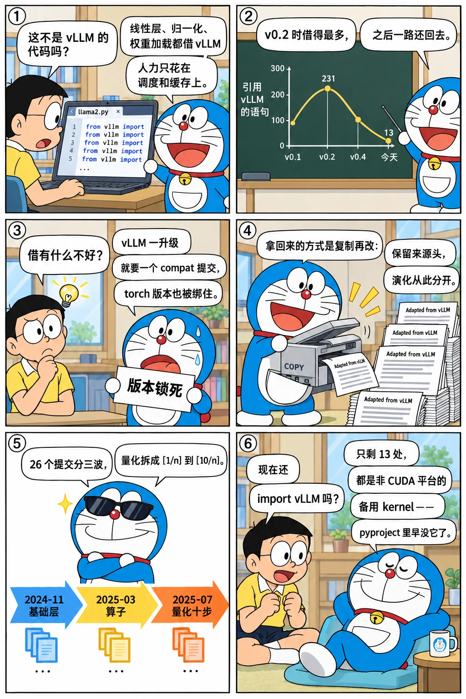
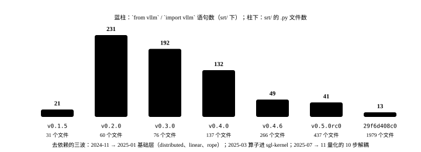

# 借力 vLLM：模型层为什么先复用再移除

<p class="lead">初版的 Llama 模型文件开头是一长串 <code>from vllm... import</code>：并行线性层、RMSNorm、RoPE、词表并行、权重加载器、进程组，全部拿现成的。这让 SGLang 能把全部精力放在调度和缓存上，也让它在接下来一年里反复被 vLLM 的版本变化绊倒。2024 年 11 月起，一场持续到 2026 年 1 月、横跨 26 个提交的"去 vLLM 依赖"把这些模块一个个变成自己的。这一章用数字讲这条曲线：引用了多少、什么时候最多、怎么拿回来的、今天还剩什么。</p>

!!! question "自测：能答上来就可以跳过本章"
    1. 初版从 vLLM 借了哪几类东西？哪些是自己写的？
    2. 依赖一个快速迭代的推理框架会带来什么具体的麻烦？从提交历史里能看到哪些证据？
    3. "去依赖"是怎么做的——重写还是复制？`srt/distributed/` 和 `srt/layers/linear.py` 的文件头说明了什么？
    4. 今天 SGLang 还 import vLLM 吗？在什么情况下？

??? success "自测参考答案（先自己答，再展开对照）"
    1. 借：模型里的层（`QKVParallelLinear`、`RowParallelLinear`、`RMSNorm`、`SiluAndMul`、`get_rope`、`VocabParallelEmbedding`）、量化配置（AWQ）、权重加载（`hf_model_weights_iterator`）、张量并行的进程组初始化。自己写：调度、基数树、内存池、注意力 kernel（Triton）、采样、服务进程。
    2. 版本锁死：`pyproject.toml` 里 vLLM 的版本从 `>=0.2.5` 变成 `==0.5.3.post1`、`==0.5.5`……每次 vLLM 升级都要一个"compat"提交（2024-05 的 #380、07 的 #598、09 的 #1276 修 vLLM 0.5.5 引入的 fp8 bug）；安装时 vLLM 的 wheel 又绑定特定的 torch 版本；新模型要等 vLLM 的层支持。
    3. 主要是复制再改：`srt/distributed/` 的文件头写着 "Adapted from vllm v0.6.4.post1 ... parallel_state.py"，`layers/linear.py` 同样；量化模块从 2025-07 开始分 10 步解耦。基准提交里有 129 个文件带 "Adapted from vLLM" 或 vLLM 的版权头。
    4. 还有 12 处，几乎都是条件导入：非 CUDA 平台（ROCm、XPU）上回退到 `vllm._custom_ops` 的 kernel（AWQ 反量化、RoPE、RMSNorm），以及几处注释。`pyproject.toml` 从 v0.5 起不再声明 vLLM 依赖。

先看一个六格小剧场，再读正文：

{.aig-comic}

## 一条先升后降的曲线

数一数每个版本里 `srt/` 下引用 vLLM 的文件数和语句数：

```bash title="vllm-imports.sh"
REF=${REF:-29f6d408c0}
printf '%-11s %6s %6s %8s\n' 版本 文件数 语句数 srt文件数
for t in v0.1.5 v0.2.0 v0.3.0 v0.4.0 v0.4.6 v0.5.0rc0 "$REF"; do
  files=$(git grep -l 'from vllm\|import vllm' "$t" -- python/sglang/srt | wc -l)
  lines=$(git grep -h 'from vllm\|import vllm' "$t" -- python/sglang/srt | wc -l)
  total=$(git ls-tree -r --name-only "$t" -- python/sglang/srt | grep -c '\.py$')
  printf '%-11s %6d %6d %8d\n' "$t" "$files" "$lines" "$total"
done
```

```text title="输出"
版本      文件数 语句数 srt文件数
v0.1.5           6     21       31
v0.2.0          32    231       60
v0.3.0          34    192       76
v0.4.0          48    132      137
v0.4.6          19     49      266
v0.5.0rc0       21     41      437
29f6d408c0      12     13     1979
```

{.aig-svg}

v0.2.0 是峰值：32 个文件、231 条 import——那时 `models/` 从 3 个文件长到 22 个，每个模型文件都像初版的 `llama2.py` 一样整段借层：

```python title="python/sglang/srt/models/llama2.py @ v0.2.0 L10-20" linenums="10"
from vllm.config import CacheConfig
from vllm.distributed import get_tensor_model_parallel_world_size
from vllm.model_executor.layers.activation import SiluAndMul
from vllm.model_executor.layers.layernorm import RMSNorm
from vllm.model_executor.layers.quantization.base_config import QuantizationConfig
from vllm.model_executor.layers.rotary_embedding import get_rope
from vllm.model_executor.layers.vocab_parallel_embedding import (
    ParallelLMHead,
    VocabParallelEmbedding,
)
from vllm.model_executor.model_loader.weight_utils import default_weight_loader
```

此后语句数一路下降，而 `srt/` 的文件数从 60 涨到近 2000。到基准提交只剩 13 条，分布在 12 个文件里，全是条件导入和注释。

## 为什么借

2024 年 1 月的 SGLang 是一篇论文的实现，人力集中在三个创新点上。vLLM 当时已经有了成熟的张量并行层、十几种模型、量化和权重加载，而且同样是 PyTorch + 自定义 kernel 的技术栈。初版 README 的致谢直说"学习了 Guidance、vLLM、LightLLM 的设计并复用了部分代码"。借的东西有一个共同特征：**和调度无关、和 GPU 算子有关**。SGLang 真正自己写的是 `RadixAttention` 这一层和它下面的三个 Triton kernel——注意力是唯一需要知道"KV 在池子的哪个槽位"的算子，其他层不需要。

## 借的代价

`pyproject.toml` 里的版本约束记录了代价：

```bash title="vllm-pins.sh"
REF=${REF:-29f6d408c0}
for t in v0.1.5 v0.2.0 v0.3.0 v0.4.0 v0.4.6 v0.5.0rc0 "$REF"; do
  printf '%-11s %s\n' "$t" "$(git show "$t:python/pyproject.toml" | grep -o '"vllm[^"]*"' | tr '\n' ' ')"
done
```

```text title="输出"
v0.1.5      "vllm>=0.2.5" 
v0.2.0      "vllm==0.5.3.post1" 
v0.3.0      "vllm==0.5.5" 
v0.4.0      "vllm>=0.6.3.post1" "vllm==0.6.3.dev13" 
v0.4.6      "vllm==0.6.7.dev2" 
v0.5.0rc0   
29f6d408c0  
```

从 `>=0.2.5` 到 `==0.5.3.post1`：越来越紧的锁定，因为借来的内部 API（`vllm.model_executor.layers.*`、`vllm.distributed`）没有稳定性承诺。提交信息里的"compat"系列就是账单：2024-05-09 "restrict vllm version"，05-12 #380 "Compat with latest VLLM 0.4.2 main"，07-09 #598 "Make sglang compat with vllm 0.5.1"，07-23 #705 "Update vllm version to support llama3.1"，09-01 #1276 "resolve the fp8 bug introduced by vLLM 0.5.5"，12-05 #2350 "limit the range of vllm versions"。还有看不见的账：vLLM 的 wheel 绑定 torch 版本，SGLang 的 torch 升级要等；vLLM 的 `_custom_ops` 编译在 ROCm、XPU 上各有各的问题；一个 `import vllm` 会把 vLLM 的全部依赖拉进进程。

## 怎么拿回来

拿回来的方式主要是**复制后改**，而不是重写：

```bash title="remove-vllm-commits.sh"
REF=${REF:-29f6d408c0}
git log --reverse --date=short --format='%ad  %h  %s' "$REF" | grep -iE 'remove.*vllm|vllm.*depend|decouple.*vllm|adapt vllm' | cut -c1-100
```

```text title="输出"
2024-11-17  38625e2139  Remove monkey_patch_vllm_dummy_weight_loader (#2064)
2024-12-01  d5b95cbb53  adapt vllm distributed module to sglang (#2244)
2025-01-07  8a6906127a  Improve linear.py to load sharded weights & remove the dependency of Paramet
2025-01-09  656aed58c6  Remove vllm dependency in model config (#2809)
2025-01-17  5dc54f1a62  feat: remove vllm distributed (#2907)
2025-01-18  2add697d7a  feat: remove vllm get_rope (#2964)
2025-03-08  b93ef5e56d  Remove the vllm dependency from the moe_align function  (#4164)
2025-03-12  e0917e6bd0  Remove vllm ops scaled fp8 quant and accelerate per token quant by 20-28% (#
2025-03-18  9b81f9bd34  sglang quant module remove vllm dependency (#4507)
2025-06-18  094c116f7d  Update python API of activation, topk, norm and rope and remove vllm depende
2025-07-17  c28ad1990d  [1/n] chore: decouple quantization implementation from vLLM dependency (#799
2025-07-19  1f76fc8747  [3/n] chore: decouple AWQ implementation from vLLM dependency (#8113)
2025-07-21  e50109f2ed  [AMD] Remove vllm's scaled_fp8_quant and moe_sum when SGLANG_USE_AITER=1 (#7
2025-08-07  aaf0ad8cdf  remove vllm fp8quant from fp8.py (#8937)
2025-08-14  5aa1ebd242  [2/n]decouple quantization implementation from vLLM dependency (#8112)
2025-08-15  2cc9eeab01  [4/n]decouple quantization implementation from vLLM dependency (#9191)
2025-08-22  9c8e4f69c3  [5/n]decouple quantization implementation from vLLM dependency (#9454)
2025-10-12  8fdcd98efe  [7/n] decouple quantization impl from vllm dependency - gguf kernel (#11019)
2025-10-23  d7e834d6ba  [6/n]decouple quantization implementation from vLLM dependency (#10750)
2025-10-22  4d4feccbb2  [ROCm] Remove vLLM rope dependency & use AITER impl (#11322)
2025-10-23  8ae9d4bb41  Revert "[ROCm] Remove vLLM rope dependency & use AITER impl" (#12028)
2025-10-24  14a4d80e57  [8/n] decouple quantization impl from vllm dependency - gguf srt (#11964)
2025-11-04  6dade6c3b5  Fix VLLM dependency test (#12670)
2025-11-11  012bfc4fdc  [9/n] decouple quantization impl from vllm dependency - adjust ci (#12753)
2025-11-21  2dec555d36  [10/n] decouple quantization impl from vllm dependency - fix import (#13524)
2026-01-09  d6d5c3fdea  [AMD] Clean up vllm dependencies in moe_runner/triton.py (#11349)
```

分三波：

1. **2024-11 → 2025-01：基础层。** #2064 去掉权重加载的猴子补丁；#2244（2024-12-01）"adapt vllm distributed module to sglang" 把 `vllm/distributed` 整个复制进 `srt/distributed/`，#2907 切断 import，#3010 再同步一次到 0.6.4.post1；#2784 自己的 `layers/linear.py`，#2809 模型配置，#2964 RoPE。这一波对应 2025 H1 路线图里的 "remove vLLM dependency" 条目。
2. **2025-03：算子。** MoE 对齐（#4164）、自定义 all-reduce（#4210）、FP8 量化 kernel（#4215）、量化模块（#4507）——这些 kernel 落到了 2024-11 新建的 `sgl-kernel/` 里（第 14 章）。
3. **2025-07 → 2025-11：量化的 10 步解耦。** `[1/n]` 到 `[10/n]` 把 AWQ、GPTQ、FP8、GGUF 等量化实现逐个从 vLLM 的实现里剥离。2026-01 的 #11349 清理 AMD 路径上最后的引用。

复制过来的文件保留了来源：

```python title="python/sglang/srt/distributed/parallel_state.py @ 29f6d408c0 L1-8" linenums="1"
# SPDX-License-Identifier: Apache-2.0
# SPDX-FileCopyrightText: Copyright contributors to the vLLM project
# Adapted from https://github.com/vllm-project/vllm/blob/v0.6.4.post1/vllm/distributed/parallel_state.py

# Copyright 2023 The vLLM team.
# Adapted from
# https://github.com/NVIDIA/Megatron-LM/blob/main/megatron/core/parallel_state.py
# Copyright (c) 2022, NVIDIA CORPORATION. All rights reserved.
```

```python title="python/sglang/srt/layers/linear.py @ 29f6d408c0 L1-3" linenums="1"
# SPDX-License-Identifier: Apache-2.0
# SPDX-FileCopyrightText: Copyright contributors to the vLLM project
"""Adapted from https://github.com/vllm-project/vllm/blob/v0.6.4.post1/vllm/model_executor/layers/linear.py"""
```

数一数带这种头的文件：

```bash title="adapted-from-vllm.sh"
REF=${REF:-29f6d408c0}
echo "带 vLLM 来源说明的文件：$(git grep -l 'Adapted from.*vllm\|adapted from vllm\|Copyright contributors to the vLLM project' "$REF" -- python/sglang/srt | wc -l)"
echo "仍然 import vllm 的语句："
git grep -h 'from vllm\|import vllm' "$REF" -- python/sglang/srt | sed 's/^ *//' | sort | uniq -c | sort -rn | head -6
```

```text title="输出"
带 vLLM 来源说明的文件：129
仍然 import vllm 的语句：
      2 from vllm._custom_ops import awq_dequantize
      2 # adapted from vllm.model_executor.layers.quantization.utils.quant_utils.is_layer_skipped
      1 import vllm.distributed.parallel_state as vllm_parallel_state
      1 from vllm.logger import logger as vllm_default_logger
      1 from vllm._custom_ops import rotary_embedding
      1 from vllm._custom_ops import fused_add_rms_norm, rms_norm
```

"Adapted from vLLM" 从一句致谢变成了 129 个文件头：代码的所有权回到了 SGLang，演化路径从此分开，而 Apache 2.0 的版权声明把来源留在了每个文件里。

## 设计取舍

| | 借用（2024） | 自有（2025 起） |
| --- | --- | --- |
| 开发速度 | 第一年新增 20 多个模型几乎零成本 | 每个层、每种量化都要自己维护 |
| 版本耦合 | 每次 vLLM 升级一个 compat 提交；torch 版本受制 | 自己决定升级节奏 |
| 多硬件 | 跟着 vLLM 的平台支持 | 自己的 `hardware_backend/`，ROCm / NPU / CPU 各自实现 |
| 性能 | 受限于 vLLM 的 kernel 选择 | sgl-kernel 可以针对自己的调度做 kernel（如 per-token 量化加速 20–28%） |

借的时机对（论文阶段）、还的时机也对（2025 年要做大规模 EP、多硬件、自己的 kernel 时）。中间那一年的 compat 提交是这个策略必须付的利息。

## 后来怎么样了

- 2024-11-30 `sgl-kernel/` 建立，2025 年 1 月改用 `TORCH_LIBRARY` 注册算子（#3130），3 月按目录重组；它成为去依赖后 kernel 的归宿（第 14 章）；
- 2025-08 `v0.5.0rc0` 的 `pyproject.toml` 不再有 vLLM；
- 基准提交里剩下的引用都在 `try/except` 或平台分支里：非 CUDA 平台上如果装了 vLLM，就借它的 `_custom_ops` 做 AWQ 反量化、RoPE、RMSNorm，否则用自己的实现；
- 两个项目继续互相借：vLLM 的工具调用解析器被改编进 `function_call/`（文件头注明），SGLang 的 `bench_serving.py` 也被 vLLM 的基准脚本参考。

## 练习

**1. 峰值在哪。** 用 `vllm-imports.sh` 的方法再加几个 tag（v0.2.5、v0.3.5、v0.4.3），找出引用语句数的精确峰值版本。

??? success "参考思路"
    `git tag --sort=creatordate | grep '^v0\.[234]'` 列出候选，把循环的 tag 列表换成它们；峰值在 v0.2.x 附近，因为那时模型数快速增加而层还没有自有实现。

**2. 一次 compat 提交的内容。** 读 `git show 33b242df30`（#380），列出 vLLM 0.4.2 改了什么 API 导致 SGLang 必须跟着改。

??? success "参考思路"
    diff 集中在 `model_runner.py` 和各模型文件：`parallel_state` 的初始化函数签名、`LinearMethodBase` 改为 `QuantizationConfig`、权重加载接口。这类"别人改了内部 API"的改动正是去依赖的动机。

**3. 复制还是重写。** 比较基准提交的 `srt/distributed/parallel_state.py` 与 vLLM v0.6.4.post1 的同名文件（`git clone` vLLM 后用 `diff`），估算改动比例。

??? success "参考思路"
    大部分内容相同，差异集中在 SGLang 加的进程组（如 DP attention、PD 分离用的组）和去掉的 vLLM 特有逻辑；这说明"复制 + 增量修改"是主要方式，也解释了为什么要保留来源注释。

!!! interview "怎么讲清楚"
    "怎么看推理框架之间互相借代码？"——用 SGLang 的曲线来讲：早期借 vLLM 的模型层让它用一年时间把精力花在调度和缓存上；代价是版本耦合（举 compat 提交为例）；2025 年为了多硬件、自有 kernel 和升级节奏，用 26 个提交把依赖拿回来，保留来源头。结论是"借与还都是时机问题"，比简单说"应该自研"或"应该复用"更有说服力。

## 小结

- [x] 初版借 vLLM 的层、量化、权重加载和进程组；自己写的是和 KV 槽位相关的注意力层与调度。
- [x] 引用在 v0.2.0 达到峰值（32 个文件、231 条），随后一路降到 13 条；`pyproject.toml` 的版本锁从 `>=` 变成 `==` 再到消失。
- [x] 去依赖的方式是复制后改：`srt/distributed/`、`layers/linear.py`、量化的 10 步解耦，129 个文件保留 vLLM 来源头。
