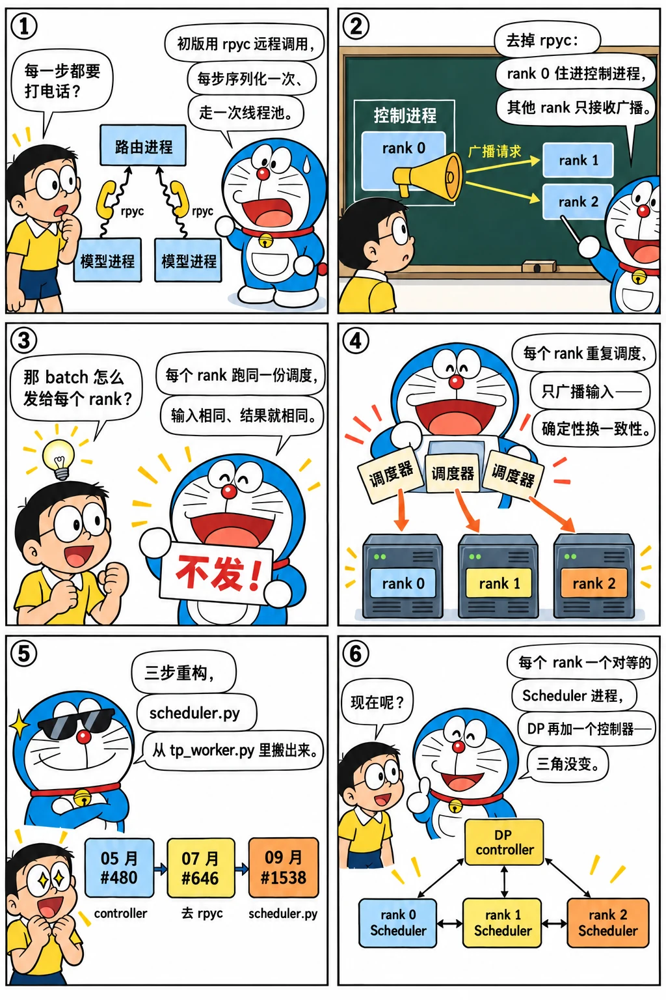

# 进程模型的两次重构：去掉 rpyc、controller 与 tp_worker

<p class="lead">初版用 rpyc 远程调用驱动每个张量并行 rank 的模型进程，调度器寄居在 rank 0 的模型进程里。2024 年上半年这个结构被改了两次：5 月的静态数据并行把 <code>router/</code> 变成 <code>controller/</code>，7 月去掉 rpyc、让 rank 0 直接住在控制进程里并用 torch.distributed 把请求广播给其他 rank；9 月底调度代码从 <code>tp_worker.py</code> 搬进独立的 <code>scheduler.py</code>，"每个 rank 一个调度器进程"的今日格局就此定型。这一章顺着 <code>managers/</code> 目录的变迁读这三步，看每一步解决了什么、留下了什么。</p>

!!! question "自测：能答上来就可以跳过本章"
    1. rpyc 在初版里负责什么？去掉它之后，rank 0 和其他 rank 之间怎么传请求？
    2. 为什么每个 TP rank 都要运行一份完全相同的调度器，而不是只让 rank 0 调度、把 batch 发给大家？
    3. `controller_single` / `controller_multi` 是什么关系？数据并行的请求分发在哪一层做？
    4. `scheduler.py` 是哪一天出现的？它从哪个文件里搬出来、留下了什么？

??? success "自测参考答案（先自己答，再展开对照）"
    1. rpyc 让路由进程像调用本地对象一样调用每个 rank 的 `ModelRpcServer.exposed_step`（每次 RPC 要序列化参数、走线程池）。去掉后，rank 0 的 `ModelTpServer` 直接在控制进程里实例化，其他 rank 各是一个进程，循环里先 `broadcast_recv_input` 等 rank 0 用 torch.distributed（gloo CPU 组）广播 pickle 过的请求列表，再各自 `exposed_step`。
    2. 调度是确定性的：输入相同、状态相同，每个 rank 算出的 batch 就相同，于是只需要在每步开始广播一次"新到的请求"，不用每步把 batch 的元数据（哪些请求、多少 token、KV 槽位）发给各 rank。代价是调度的 CPU 工作在每个 rank 上重复做一遍。
    3. `controller_single` 管一组 TP rank（一个数据并行副本）；`controller_multi` 管多个副本，收请求后按轮询或最短队列分给某个副本的 `controller_single`（当时用 `multiprocessing.Queue`）。分发在 controller 这一层，和调度解耦。
    4. 2024-09-29 的 #1538 "Move scheduler code from tp_worker.py to scheduler.py"：887 行搬进新文件，`tp_worker.py` 只剩模型执行的包装（`TpModelWorker`），这也是 2024 年 10 月重叠调度能做成"调度线程 + 执行线程"的前提。

先看一个六格小剧场，再读正文：

{.aig-comic}

## 用目录讲故事

`managers/` 目录四个版本的样子：

```bash title="managers-tree.sh"
REF=${REF:-29f6d408c0}
for t in v0.1.5 v0.2.0 v0.3.0 v0.4.0; do
  echo "== $t"; git ls-tree -r --name-only $t -- python/sglang/srt/managers | sed 's|python/sglang/srt/managers/||' | tr '\n' ' '; echo
done
echo "== $REF：$(git ls-tree -r --name-only "$REF" -- python/sglang/srt/managers | grep -c '\.py$') 个文件"
```

```text title="输出"
== v0.1.5
detokenizer_manager.py io_struct.py openai_protocol.py router/infer_batch.py router/manager.py router/model_rpc.py router/model_runner.py router/radix_cache.py router/scheduler.py tokenizer_manager.py 
== v0.2.0
controller/cuda_graph_runner.py controller/infer_batch.py controller/manager_multi.py controller/manager_single.py controller/model_runner.py controller/radix_cache.py controller/schedule_heuristic.py controller/tp_worker.py detokenizer_manager.py io_struct.py tokenizer_manager.py 
== v0.3.0
controller_multi.py controller_single.py detokenizer_manager.py io_struct.py policy_scheduler.py schedule_batch.py tokenizer_manager.py tp_worker.py 
== v0.4.0
data_parallel_controller.py detokenizer_manager.py image_processor.py io_struct.py schedule_batch.py schedule_policy.py scheduler.py session_controller.py tokenizer_manager.py tp_worker.py tp_worker_overlap_thread.py 
== 29f6d408c0：53 个文件
```

四个快照对应四种进程模型。把中间的关键提交列出来：

```bash title="process-commits.sh"
for h in 0463f7fb52 d774acad5c cdcbde5fc3 048685430d f86c1e611f 23cc66f7b6 b48edff67f; do
  git log -1 --date=short --format='%ad  %h  %s' $h | cut -c1-100
done
```

```text title="输出"
2024-05-27  0463f7fb52  Support data parallelism (static) (#480)
2024-07-18  d774acad5c  Remove the dependency of rpyc (#646)
2024-07-29  cdcbde5fc3  Code structure refactor (#807)
2024-09-29  048685430d  Improve process creation (#1534)
2024-09-29  f86c1e611f  Move scheduler code from tp_worker.py to scheduler.py (#1538)
2024-10-11  23cc66f7b6  Add back data parallelism (#1635)
2024-10-20  b48edff67f  Split the overlapped version of TpModelWorkerClient into a separate file (#1
```

{.aig-svg}

## 第一步：静态数据并行（#480，2024-05-27）

[第二章](../origins/first-commit.md)的初版只有一个路由进程，`--tp-size` 决定模型进程的个数。5 月的 #480 加了 `--dp-size`：`router/` 改名 `controller/`，`model_rpc.py` 改名 `tp_worker.py`（名字第一次出现），`manager.py` 变成 `manager_single.py`，新增 `manager_multi.py` 和 `dp_worker.py`。`ControllerMulti` 收请求后分给某个数据并行副本：

```python title="python/sglang/srt/managers/controller/manager_multi.py @ v0.2.0 L124-135" linenums="124"
    def round_robin_scheduler(self, input_requests):
        for r in input_requests:
            self.workers[self.round_robin_counter].queue.put(r)
            self.round_robin_counter = (self.round_robin_counter + 1) % len(
                self.workers
            )

    def shortest_queue_scheduler(self, input_requests):
        for r in input_requests:
            queue_sizes = [worker.queue.qsize() for worker in self.workers]
            wid = np.argmin(queue_sizes)
            self.workers[wid].queue.put(r)
```

只有两种策略：轮询和最短队列，队列长度直接用 `multiprocessing.Queue.qsize()`。它不知道各副本的缓存里有什么——论文里"路由器维护元树、按前缀命中分发"的设想此时还没有实现，要到 10 月的 Rust 路由器才出现（第 13 章）。"静态"的意思是副本数在启动时固定，每个副本一组 GPU（`gpu_ids = range(dp_worker_id * tp_size, …)`）。

这一步仍然用 rpyc：`dp_worker.py` 的 102 行就是为每个副本起 rpyc 客户端。

## 第二步：去掉 rpyc（#646，2024-07-18）

两个月后，一个标题只有六个词的提交删了 551 行、加了 303 行：rank 0 的 `ModelTpServer` 不再是远程对象，而是直接在控制进程里实例化；其他 rank 由 `launch_tp_servers` 起成普通进程：

```python title="python/sglang/srt/managers/controller/manager_single.py @ v0.2.0 L55-91" linenums="55"
        # Launch other tp ranks
        tp_size_local = server_args.tp_size // server_args.nnodes
        self.tp_procs = []
        if tp_size_local > 1:
            tp_rank_range = range(1, tp_size_local)
            self.tp_procs = launch_tp_servers(
                gpu_ids,
                tp_rank_range,
                server_args,
                port_args.nccl_ports[dp_worker_id],
                model_overide_args,
            )

        # Launch tp rank 0
        self.tp_server = ModelTpServer(
            gpu_ids[0],
            0,
            server_args,
            port_args.nccl_ports[dp_worker_id],
            model_overide_args,
        )
        self.tp_cpu_group = self.tp_server.model_runner.tp_group.cpu_group

    def loop_for_forward(self):
        while True:
            if not self.is_dp_worker:
                recv_reqs = self.recv_requests_from_zmq()
            else:
                recv_reqs = self.recv_requests_from_mp_queue()

            if self.tp_size > 1:
                broadcast_recv_input(recv_reqs, 0, self.tp_cpu_group)

            out_pyobjs = self.tp_server.exposed_step(recv_reqs)

            for obj in out_pyobjs:
                self.send_to_detokenizer.send_pyobj(obj)
```

`loop_for_forward` 每一轮：非阻塞地把 ZMQ 里积压的请求全收下来（`recv_requests_from_zmq`），`tp_size > 1` 时把这批请求广播给其他 rank，然后在本进程里跑 `exposed_step`。其他 rank 的循环和广播的实现：

```python title="python/sglang/srt/managers/controller/tp_worker.py @ v0.2.0 L730-753,772-800"
def run_tp_server(
    gpu_id: int,
    tp_rank: int,
    server_args: ServerArgs,
    nccl_port: int,
    model_overide_args: dict,
):
    """Run a tensor parallel server."""
    try:
        model_server = ModelTpServer(
            gpu_id,
            tp_rank,
            server_args,
            nccl_port,
            model_overide_args,
        )
        tp_cpu_group = model_server.model_runner.tp_group.cpu_group

        while True:
            recv_reqs = broadcast_recv_input(None, tp_rank, tp_cpu_group)
            model_server.exposed_step(recv_reqs)
    except Exception:
        logger.error("Exception in run_tp_server:\n" + get_exception_traceback())
        raise
...
def broadcast_recv_input(data, rank, dist_group):
    """Broadcast inputs from rank=0 to all other ranks with torch.dist backend."""

    if rank == 0:
        if len(data) == 0:
            tensor_size = torch.tensor([0], dtype=torch.long)
            dist.broadcast(tensor_size, src=0, group=dist_group)
        else:
            serialized_data = pickle.dumps(data)
            size = len(serialized_data)
            tensor_data = torch.ByteTensor(list(serialized_data))
            tensor_size = torch.tensor([size], dtype=torch.long)

            dist.broadcast(tensor_size, src=0, group=dist_group)
            dist.broadcast(tensor_data, src=0, group=dist_group)
    else:
        tensor_size = torch.tensor([0], dtype=torch.long)
        dist.broadcast(tensor_size, src=0, group=dist_group)
        size = tensor_size.item()

        if size == 0:
            return []

        tensor_data = torch.empty(size, dtype=torch.uint8)
        dist.broadcast(tensor_data, src=0, group=dist_group)

        serialized_data = bytes(tensor_data.tolist())
        data = pickle.loads(serialized_data)
        return data
```

`broadcast_recv_input` 用的是 torch.distributed 的 **CPU 进程组**（`tp_group.cpu_group`，gloo 后端）：rank 0 先广播长度、再广播 pickle 后的字节；没有新请求时只广播一个 0。这就是今天 `Scheduler.recv_requests` 里 `broadcast_pyobj` 的雏形。三个设计点：

1. **调度在每个 rank 上重复执行。** 每个 rank 拿到相同的请求列表，各自跑一份完全相同的 `exposed_step`（前缀匹配、准入、组 batch、采样）。只要调度是确定性的（随机数种子相同），各 rank 算出的 batch 就一致，前向时 NCCL 集合通信自然对齐。代价是 CPU 工作 × TP 份；收益是每步只需广播一次"输入"，而不是广播 batch 的所有元数据。
2. **rank 0 和控制逻辑同进程。** 去掉一次 RPC 跳转，也去掉 rpyc 的线程池和序列化。
3. **控制面和数据面分开走。** 请求用 gloo 在 CPU 上广播，张量用 NCCL 在 GPU 上通信，互不干扰。

`ControllerSingle` 还支持 `--nnodes`：`tp_size_local = tp_size // nnodes`，多机张量并行时每台机器起自己那部分 rank。

## 第三步：目录压平与 `scheduler.py` 的诞生

7 月 29 日的 #807 "Code structure refactor" 把 `controller/` 压平：`controller_single.py`、`controller_multi.py`、`tp_worker.py`、`schedule_batch.py`（原 `infer_batch.py`）、`policy_scheduler.py` 直接放在 `managers/` 下，`radix_cache.py` 和 `memory_pool.py` 搬进新的 `mem_cache/`，`model_runner.py` 和 `cuda_graph_runner.py` 搬进 `model_executor/`——这是今天目录结构的直接来源（[第 10 章](../perf/restructure.md)专门讲这次重组）。

9 月 29 日的两个提交完成最后一步。#1534 "Improve process creation" 重做了进程启动；#1538 把 853 行调度代码从 `tp_worker.py` 搬进新建的 `managers/scheduler.py`（887 行），`tp_worker.py` 只剩下 `TpModelWorker`：持有 `ModelRunner`、负责"给一个 batch，跑一次前向、采样一次"。v0.4.0（2024-12）的 `scheduler.py` 已有 1500 行，进程入口长这样：

```python title="python/sglang/srt/managers/scheduler.py @ v0.4.0 L1464-1500" linenums="1464"
def run_scheduler_process(
    server_args: ServerArgs,
    port_args: PortArgs,
    gpu_id: int,
    tp_rank: int,
    dp_rank: Optional[int],
    pipe_writer,
):
    # set cpu affinity to this gpu process
    if get_bool_env_var("SGLANG_SET_CPU_AFFINITY"):
        set_gpu_proc_affinity(server_args.tp_size, server_args.nnodes, gpu_id)

    # [For Router] if env var "SGLANG_DP_RANK" exist, set dp_rank to the value of the env var
    if dp_rank is None and "SGLANG_DP_RANK" in os.environ:
        dp_rank = int(os.environ["SGLANG_DP_RANK"])

    if dp_rank is None:
        configure_logger(server_args, prefix=f" TP{tp_rank}")
    else:
        configure_logger(server_args, prefix=f" DP{dp_rank} TP{tp_rank}")

    suppress_other_loggers()
    parent_process = psutil.Process().parent()

    try:
        scheduler = Scheduler(server_args, port_args, gpu_id, tp_rank, dp_rank)
        pipe_writer.send(
            {"status": "ready", "max_total_num_tokens": scheduler.max_total_num_tokens}
        )
        if scheduler.enable_overlap:
            scheduler.event_loop_overlap()
        else:
            scheduler.event_loop_normal()
    except Exception:
        traceback = get_exception_traceback()
        logger.error(f"Scheduler hit an exception: {traceback}")
        parent_process.send_signal(signal.SIGQUIT)
```

每个 TP rank 一个 `Scheduler` 进程，进程里建 `TpModelWorker`（或者带重叠的 `TpModelWorkerClient`），`event_loop_normal` / `event_loop_overlap` 二选一。`controller_single` / `controller_multi` 在这次重构里消失，数据并行一度被拿掉，10 月 11 日 #1635 "Add back data parallelism" 以 `data_parallel_controller.py` 的形式加回：DP 控制器自己是一个进程，负责起各副本的调度器进程并分发请求，分发从 `multiprocessing.Queue` 改成 ZMQ。

## 今天：一个节点上有哪些进程

基准提交里进程由 `entrypoints/engine.py` 的 `_launch_scheduler_processes` 拉起（`_launch_subprocesses` 先起它，再起反分词进程和 HTTP 服务）：

```python title="python/sglang/srt/entrypoints/engine.py @ 29f6d408c0 L888-947" linenums="888"
        use_dp_controller = (
            get_parallel().num_dp_ranks > 1 or get_exec().moe.ep_join_mode == "scale"
        )

        if not use_dp_controller:
            # Launch tensor parallel scheduler processes
            memory_saver_adapter = TorchMemorySaverAdapter.create(
                enable=get_exec().features.enable_memory_saver
            )
            scheduler_pipe_readers = []

            pp_rank_range, tp_rank_range, pp_size_per_node, tp_size_per_node = (
                _calculate_rank_ranges(get_parallel().node_rank)
            )

            for pp_rank in pp_rank_range:
                for tp_rank in tp_rank_range:
                    reader, writer = mp.Pipe(duplex=False)
                    gpu_id = (
                        get_device().base_gpu_id
                        + ((pp_rank % pp_size_per_node) * tp_size_per_node)
                        + (tp_rank % tp_size_per_node) * get_device().gpu_id_step
                    )

                    with maybe_reindex_device_id(gpu_id) as gpu_id:
                        proc = mp.Process(
                            target=run_scheduler_process_func,
                            args=(
                                server_args,
                                port_args,
                                gpu_id,
                                tp_rank,
                                pp_rank,
                                None,
                                writer,
                            ),
                        )
                        with (
                            memory_saver_adapter.configure_subprocess(),
                            numa_utils.configure_subprocess(server_args, gpu_id),
                        ):
                            proc.start()

                    scheduler_procs.append(proc)
                    scheduler_pipe_readers.append(reader)
        else:
            # Launch the data parallel controller
            reader, writer = mp.Pipe(duplex=False)
            scheduler_pipe_readers = [reader]
            proc = mp.Process(
                target=run_data_parallel_controller_process,
                kwargs=dict(
                    server_args=server_args,
                    port_args=port_args,
                    pipe_writer=writer,
                    run_scheduler_process_func=run_scheduler_process_func,
                ),
            )
            proc.start()
            scheduler_procs.append(proc)
```

两层循环：流水线并行的每个 stage × 张量并行的每个 rank 各一个调度器进程（`gpu_id` 由 pp_rank 和 tp_rank 算出，每个子进程通过一个 `Pipe` 回报就绪）；`dp_size > 1` 时改为起一个 `DataParallelController` 进程，由它再起 `dp_size` 组调度器；反分词仍是单独的进程；主进程里是 `TokenizerManager` 和 HTTP / gRPC 服务。和初版比，"分词 → 调度 + 执行 → 反分词"的三角没变，变的是中间那一角从"一个路由进程 + N 个 rpyc 服务"变成"N 个对等的调度器进程"。

## 设计取舍

| 方案 | 请求怎么到各 rank | 调度在哪 | 代价 |
| --- | --- | --- | --- |
| 初版（rpyc） | 路由进程对每个 rank 发 RPC | rank 0 的模型进程 | 每步一次 RPC 序列化 + 线程池；路由进程是额外的一跳 |
| v0.2（广播） | rank 0 用 gloo 广播 pickle | 控制进程（含 rank 0） | 调度 CPU 工作 × TP；pickle 大请求（多模态）慢 |
| v0.4 至今（对等调度器） | 同上，`broadcast_pyobj` | 每个 rank 的 Scheduler 进程 | 同上；多了 DP 控制器一跳 |

"每个 rank 重复调度"这个决定一直没有被推翻，因为它把最难的问题（各 rank 的 batch 一致）变成了"输入一致 + 确定性"这两个容易保证的条件。后来的重叠调度、投机解码、PD 分离都建立在这个前提上；真正改变的是分发层：2025 年 Rust 网关接管了跨实例的路由（第 21 章），`DataParallelController` 负责实例内的副本。

## 后来怎么样了

- 2024-10：`tp_worker_overlap_thread.py`（#1726）——`TpModelWorkerClient` 把前向放到另一个线程，调度器线程不再等 GPU（[第 12 章](../perf/overlap.md)）；
- 2025-01：`entrypoints/engine.py` 成为统一的启动入口，HTTP 服务、离线 `Engine`、RL 框架里嵌入的引擎共用同一套子进程拉起逻辑；
- 2025-05：流水线并行加入，调度器进程数变成 PP × TP；
- 2025 下半年：`DataParallelController` 学会按负载预算分发（`DPBudget`）、弹性增减副本（`add_elastic_workers`），`scheduler.py` 拆出 `scheduler_components/` 和一组 mixin（输出处理、PP、控制消息）。

## 练习

**1. 广播的内容。** 读 v0.2.0 的 `broadcast_recv_input`，说明为什么要先广播一个"长度"张量。如果请求里带着一张 4 MB 的图片会怎样？

??? success "参考答案"
    `dist.broadcast` 需要接收方事先知道张量大小，所以先广播长度再广播内容。图片以 `pixel_values`（numpy 数组）的形式在请求对象里，会被 pickle 后逐字节广播给每个 rank；多模态请求因此在 CPU 上多了一次大对象的序列化和复制，后来的版本把图片处理挪到 `TokenizerManager`，并用哈希做缓存键减少重复传输。

**2. 为什么 DP 一度消失。** 用 `git log --date=short --format='%ad %h %s' -- python/sglang/srt/managers/controller_multi.py` 找出 `controller_multi.py` 被删的提交，并看同一时期 `data_parallel_controller.py` 的第一个版本和它有什么不同。

??? success "参考思路"
    `controller_multi.py` 在 #1534 / #1538 前后被删（2024-09-29）；#1635（2024-10-11）新建的 `data_parallel_controller.py` 不再用 `multiprocessing.Queue`，而是给每个副本一个 ZMQ 端口，控制器自己也是一个进程；负载均衡策略保留了轮询和最短队列。

**3. 数一数今天的进程。** 读基准提交的 `_launch_subprocesses`，写出 `--tp-size 4 --pp-size 2 --dp-size 2` 在单机上会起多少个进程、各是什么。

??? success "参考答案"
    DP 控制器 1 个；每个 DP 副本 PP × TP = 8 个调度器进程，两个副本共 16 个；反分词 1 个；主进程 1 个（HTTP + TokenizerManager）。共 19 个进程（不含可能的多模态处理子进程）。

!!! interview "怎么讲清楚"
    "SGLang 的多卡调度是怎么保持一致的？"——答案是"每个 rank 跑一份相同的调度器，每步只广播新请求"，再解释为什么可行（确定性）和代价（CPU 重复）。能补上它的来历（2024-07 去掉 rpyc 的那次重构）和后续（重叠线程、DP 控制器、PP），就说明你知道这是一个有意的设计而不是偶然。

## 小结

- [x] `router/`（rpyc）→ `controller/`（静态 DP，#480）→ 去 rpyc、rank 0 进控制进程、gloo 广播请求（#646）→ 压平目录（#807）→ `scheduler.py` 独立（#1538）。
- [x] "每个 rank 重复调度、只广播输入"是贯穿至今的决定；分发层从 `multiprocessing.Queue` 到 ZMQ 再到 Rust 网关。
- [x] 今天：主进程（分词 + HTTP）、PP × TP 个调度器进程、反分词进程，DP 时再加一个控制器进程。
