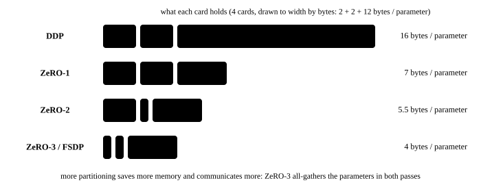

# ZeRO and FSDP: partitioning the optimizer states, the gradients and the parameters

<p class="lead">Every card under data parallelism holds a complete set of model states: parameters, gradients and optimizer states, 16 bytes per parameter. On 64 cards that is 64 identical copies of the Adam state, an enormous waste. ZeRO's idea is this: since each card only needs some part of it at any one moment, partition those states so that each card stores 1/N and fetches what it needs by communicating. This chapter implements an Adam with partitioned optimizer states from scratch, runs PyTorch's FSDP2 on a CPU, and works out the memory and communication cost of all three stages.</p>

!!! question "Self-test: if you can answer these, skip the chapter"
    1. What do ZeRO-1, ZeRO-2 and ZeRO-3 each partition? How large are the model states per card in each?
    2. How does ZeRO-1 and ZeRO-2's communication compare with plain data parallelism? And ZeRO-3's?
    3. When does ZeRO-3 communicate during the forward and backward passes? Why does it prefetch?
    4. How does FSDP relate to ZeRO-3? How do you choose the granularity of an FSDP unit?
    5. Can ZeRO reduce the memory the activations take?

??? success "Answers for the self-test (answer first, then open this)"
    1. ZeRO-1 partitions the optimizer states, $4\Psi + 12\Psi/N$ bytes per card; ZeRO-2 also partitions the gradients, $2\Psi + 14\Psi/N$; ZeRO-3 also partitions the parameters, $16\Psi/N$ (where $\Psi$ is the parameter count and $N$ the card count).
    2. ZeRO-1 and 2 match plain data parallelism: an all-reduce already equals a reduce-scatter plus an all-gather, and ZeRO merely uses the two halves separately (reduce-scatter the gradients, update your own segment, then all-gather the parameters). ZeRO-3 is about 1.5 times: the parameters have to be all-gathered once in the forward pass and once in the backward, plus one reduce-scatter of the gradients.
    3. Each unit (one layer or a few) all-gathers its complete parameters before it is used in the forward and backward passes and releases them afterwards; after a unit's gradients are computed in the backward pass they are reduce-scattered. Prefetching means firing the next unit's all-gather while the current one is still computing, which hides the communication behind the computation.
    4. FSDP is PyTorch's implementation of ZeRO-3's idea. Too small a unit means many collectives with small messages and poor efficiency; too large means more complete parameters unfolded at once and a higher memory peak. The usual choice is to wrap by Transformer layer.
    5. It cannot; it only partitions the model states (parameters, gradients, optimizer states). The activations have to be reduced by recomputation, tensor plus sequence parallelism, or context parallelism.

A six-panel strip first, then the chapter:

<!-- comic ../assets/comics/zero.webp is in Chinese; put it back once the English version exists -->

## The three stages {#三个级别}

With a parameter count $\Psi$ and a data-parallel degree $N$, under mixed-precision Adam:

| Stage | Partitions | Model states per card | Communication per step (sent per card) |
| --- | --- | --- | --- |
| Data parallelism | nothing | $16\Psi$ | an all-reduce of the bf16 gradients: about $2 \times 2\Psi = 4\Psi$ bytes |
| ZeRO-1 | the optimizer states | $4\Psi + 12\Psi/N$ | the same (reduce-scatter the gradients plus all-gather the parameters, the same total as an all-reduce) |
| ZeRO-2 | plus the gradients | $2\Psi + 14\Psi/N$ | the same |
| ZeRO-3 | plus the parameters | $16\Psi/N$ | about 1.5 times: all-gather the parameters in the forward pass, all-gather again in the backward, reduce-scatter the gradients |

{.aig-svg}

Change the model size and the parallel degree and see what each of the four stages leaves, and whether it fits on a card:

<div class="aig-widget" data-widget="zeromem"></div>

ZeRO-1 and 2 **add no communication**: an all-reduce is already a reduce-scatter plus an all-gather, and ZeRO merely moves the middle step (the optimizer update) onto the slices. After the reduce-scatter each card holds exactly the summed gradient of its own slice, uses it to update its own slice of the parameters, and all-gathers the complete parameters back. ZeRO-3 does not even keep the parameters resident: every layer's parameters have to be all-gathered before it is used in the forward and backward passes, which is the one extra all-gather.

## Implementing ZeRO's Adam from scratch {#从零实现-zero-的-adam}

Flatten all of the parameters into one vector and split it evenly into $N$ slices by rank. Each rank keeps only its own slice's master parameters and Adam's two moments:

```python title="zero_adam.py"
import math

import torch
import torch.distributed as dist


class ZeroAdam:
    """ZeRO（第 2 级）的 Adam：梯度用 reduce-scatter 求和并切分，每个 rank 只保存、只更新自己那一片参数的
    主参数和 Adam 状态，更新完用 all-gather 把参数拼回来。"""

    def __init__(self, params, lr, betas=(0.9, 0.999), eps=1e-8):
        self.params = list(params)
        self.lr, self.betas, self.eps, self.t = lr, betas, eps, 0
        self.rank, self.world = dist.get_rank(), dist.get_world_size()
        self.numel = sum(p.numel() for p in self.params)
        self.shard = math.ceil(self.numel / self.world)          # how many elements each rank is responsible for (padded with zeros at the end to align)
        flat = self._flatten([p.data for p in self.params])
        lo = self.rank * self.shard
        self.master = flat[lo:lo + self.shard].clone()           # keep only your own slice (in real training these are the fp32 master parameters)
        self.m = torch.zeros_like(self.master)
        self.v = torch.zeros_like(self.master)

    def _flatten(self, tensors):
        flat = torch.zeros(self.shard * self.world)
        flat[:self.numel] = torch.cat([t.flatten() for t in tensors])
        return flat

    def step(self):
        grads = self._flatten([p.grad for p in self.params])
        g = torch.empty(self.shard)
        dist.reduce_scatter_tensor(g, grads)                     # sum and partition: each rank gets only its own slice's gradients
        g /= self.world                                          # take the average
        self.t += 1
        b1, b2 = self.betas
        self.m.mul_(b1).add_(g, alpha=1 - b1)
        self.v.mul_(b2).addcmul_(g, g, value=1 - b2)
        m_hat = self.m / (1 - b1 ** self.t)
        v_hat = self.v / (1 - b2 ** self.t)
        self.master -= self.lr * m_hat / (v_hat.sqrt() + self.eps)
        full = torch.empty(self.shard * self.world)
        dist.all_gather_into_tensor(full, self.master)           # assemble every rank's updated slice back into the complete parameters
        offset = 0
        for p in self.params:
            p.data.copy_(full[offset:offset + p.numel()].view_as(p))
            offset += p.numel()

    def zero_grad(self):
        for p in self.params:
            p.grad = None

    def state_bytes(self):
        return sum(t.numel() * t.element_size() for t in (self.master, self.m, self.v))
```

Training 3 steps across 4 processes, against single-process `torch.optim.Adam` on the full batch:

```python title="zero_check.py" torchrun="4"
import torch
import torch.distributed as dist

from zero_adam import ZeroAdam

dist.init_process_group("gloo")
rank, world = dist.get_rank(), dist.get_world_size()


def make_model():
    torch.manual_seed(0)
    return torch.nn.Sequential(torch.nn.Linear(64, 256), torch.nn.GELU(), torch.nn.Linear(256, 10))


torch.manual_seed(123)
X, Y = torch.randn(32, 64), torch.randint(0, 10, (32,))
local = slice(rank * 32 // world, (rank + 1) * 32 // world)
loss_fn = torch.nn.CrossEntropyLoss()

ref, model = make_model(), make_model()
opt_ref = torch.optim.Adam(ref.parameters(), lr=1e-2)
opt = ZeroAdam(model.parameters(), lr=1e-2)
for step in range(3):
    opt_ref.zero_grad()
    loss_fn(ref(X), Y).backward()
    opt_ref.step()
    opt.zero_grad()
    loss_fn(model(X[local]), Y[local]).backward()
    opt.step()

diff = max((a - b).abs().max().item() for a, b in zip(ref.parameters(), model.parameters()))
full_state = 3 * sum(p.numel() for p in model.parameters()) * 4   # unpartitioned: the master parameters plus two moments, in fp32
if rank == 0:
    print("训练 3 步后与单进程的 Adam 一致：", diff < 1e-5)
    print(f"每个 rank 的优化器状态 {opt.state_bytes()} 字节，不切分时 {full_state} 字节，约为 1/{round(full_state / opt.state_bytes())}")
dist.destroy_process_group()
```

```text title="output"
训练 3 步后与单进程的 Adam 一致： True
每个 rank 的优化器状态 57636 字节，不切分时 230520 字节，约为 1/4
```

Each rank's gradients are still complete in this implementation (the backward pass produces complete gradients as usual). Real ZeRO-2 reduce-scatters **by bucket** during the backward pass and releases the complete gradient as soon as a bucket has gone out, so the gradients' resident memory drops to $1/N$ as well.

## ZeRO-3 and FSDP {#zero-3-与-fsdp}

ZeRO-3 partitions the parameters too. The model is divided into **units** (usually one Transformer layer), and each unit's flow is:

1. **Forward**: all-gather this unit's complete parameters, compute, then release them and keep only your own slice.
2. **Backward**: all-gather the complete parameters again, compute the gradients, reduce-scatter them so each rank keeps its own slice, then release the complete parameters and gradients.

So at any moment only the complete parameters of the one unit currently computing are in memory. To keep the communication from being exposed it has to **prefetch**: all-gather layer $i+1$'s parameters while layer $i$ is computing. The larger the unit, the less and the chunkier the communication, but the higher the memory peak; dividing by Transformer layer is the common compromise.

PyTorch's **FSDP** (Fully Sharded Data Parallel) is the implementation of ZeRO-3. The newer FSDP2 (`fully_shard`) represents each parameter as a `DTensor` partitioned along dimension 0:

```python title="fsdp2_check.py" torchrun="2"
import torch
import torch.distributed as dist
from torch.distributed.device_mesh import init_device_mesh
from torch.distributed.fsdp import fully_shard

dist.init_process_group("gloo")
rank, world = dist.get_rank(), dist.get_world_size()
mesh = init_device_mesh("cpu", (world,))          # on a GPU this is init_device_mesh("cuda", ...)


def make_model():
    torch.manual_seed(0)
    return torch.nn.Sequential(torch.nn.Linear(64, 256), torch.nn.GELU(), torch.nn.Linear(256, 10))


torch.manual_seed(123)
X, Y = torch.randn(32, 64), torch.randint(0, 10, (32,))
local = slice(rank * 32 // world, (rank + 1) * 32 // world)
loss_fn = torch.nn.CrossEntropyLoss()

ref, model = make_model(), make_model()
for layer in model:                               # each linear layer is one FSDP unit: its parameters are all-gathered only when it is used
    if isinstance(layer, torch.nn.Linear):
        fully_shard(layer, mesh=mesh)
fully_shard(model, mesh=mesh)

w = model[0].weight
shapes = [None] * world
dist.all_gather_object(shapes, tuple(w.to_local().shape))
opt_ref = torch.optim.Adam(ref.parameters(), lr=1e-2)
opt = torch.optim.Adam(model.parameters(), lr=1e-2)    # the optimizer acts directly on the partitioned parameters, so the states are partitioned too
for step in range(3):
    opt_ref.zero_grad()
    loss_fn(ref(X), Y).backward()
    opt_ref.step()
    opt.zero_grad()
    loss_fn(model(X[local]), Y[local]).backward()
    opt.step()

full = [p.full_tensor() for p in model.parameters()]   # assemble the slices back into complete parameters for debugging
diff = max((a - b).abs().max().item() for a, b in zip(ref.parameters(), full))
if rank == 0:
    print(f"第一层权重的类型：{type(w).__name__}，完整形状 {tuple(w.shape)}，各 rank 本地的形状 {shapes}")
    print("训练 3 步后与单进程一致：", diff < 1e-5)
dist.destroy_process_group()
```

```text title="output"
第一层权重的类型：DTensor，完整形状 (256, 64)，各 rank 本地的形状 [(128, 64), (128, 64)]
训练 3 步后与单进程一致： True
```

Each rank holds only 128 rows locally; the optimizer acts directly on the partitioned parameters, so the optimizer states are naturally partitioned too.

## Which stage to use when {#什么时候用哪一级}

- **ZeRO-1 / ZeRO-2**: no extra communication, so the memory saving is all but free. This is the most common choice alongside tensor and pipeline parallelism (Megatron-LM's distributed optimizer is ZeRO-1).
- **ZeRO-3 / FSDP**: the model states are fully partitioned along the data-parallel dimension, which suits a model that is not too large and a wish to avoid tensor parallelism (training a model of a few tens of billions with pure FSDP, as torchtitan and the training side of many reinforcement-learning frameworks do). The price is 1.5 times the communication, plus each layer's all-gather latency, which has to be hidden by prefetching.
- **ZeRO does not reduce the activations**: those are proportional to the batch size and the sequence length and have to be addressed by recomputation, tensor plus sequence parallelism, or context parallelism (the line in the overview where ZeRO-3 still does not fit is the activations).

**Offloading** (ZeRO-Offload, ZeRO-Infinity) puts the optimizer states or even the parameters in CPU memory or on NVMe, trading PCIe bandwidth for device memory, which suits few cards, a large model and no great demand for speed.

!!! interview "How to answer in an interview"
    On ZeRO, give the model states per card first ($\Psi$ the parameter count, $N$ the card count): ZeRO-1 partitions the optimizer states for $4\Psi + 12\Psi/N$, ZeRO-2 also the gradients for $2\Psi + 14\Psi/N$, ZeRO-3 also the parameters for $16\Psi/N$. The communication: ZeRO-1 and 2 match plain data parallelism (the all-reduce split into a reduce-scatter and an all-gather) and ZeRO-3 is about 1.5 times, needing one parameter all-gather in each of the forward and backward passes, hidden by prefetching unit by unit. FSDP is PyTorch's ZeRO-3, and FSDP2 represents the parameters as DTensors partitioned along dimension 0. Finish with the reminder that ZeRO does not reduce the activations, which need recomputation, tensor plus sequence parallelism, or context parallelism.

## Exercises {#练习}

1. A 13B model trains on 16 cards of 80 GB. Compute the model states per card under ZeRO-1, ZeRO-2 and ZeRO-3. Looking at the model states alone, from which stage onward is there more than 40 GB left for the activations?

??? success "Answer"
    $\Psi = 13 \times 10^9$ and $N = 16$: ZeRO-1 $= 4\Psi + 12\Psi/16 = 52 + 9.75 = 61.75$ GB; ZeRO-2 $= 2\Psi + 14\Psi/16 = 26 + 11.4 = 37.4$ GB; ZeRO-3 $= 16\Psi/16 = 13$ GB.
    To leave 40 GB for the activations (model states no more than about 40 GB on an 80 GB card): ZeRO-2 just about does, and ZeRO-3 comfortably.

2. Why is it said that ZeRO-1 and ZeRO-2 add no communication, rather than halving it?

??? success "Answer"
    Plain data parallelism's all-reduce is implemented as a reduce-scatter plus an all-gather anyway, sending $2(N-1)/N$ times the gradients' size per card.
    ZeRO-1 and 2 split those two steps apart: reduce-scatter the gradients, update on the slice, all-gather the parameters. The parameters and the gradients are both bf16 and the same size, so the total communication is exactly the same as the all-reduce's. What is saved is memory alone; the communication neither grows nor shrinks.

## Summary {#小结}

- [x] ZeRO-1 partitions the optimizer states, ZeRO-2 also the gradients, ZeRO-3 also the parameters; the model states per card are $4\Psi + 12\Psi/N$, $2\Psi + 14\Psi/N$ and $16\Psi/N$ respectively.
- [x] ZeRO-1 and 2's communication matches plain data parallelism (the all-reduce split into a reduce-scatter and an all-gather); ZeRO-3's is about 1.5 times.
- [x] ZeRO-3 and FSDP all-gather a unit's parameters before use and release them afterwards, hiding the communication by prefetching; FSDP2 represents the parameters as DTensors partitioned along dimension 0.
- [x] ZeRO does not reduce the activations; those need recomputation, tensor plus sequence parallelism, or context parallelism.
