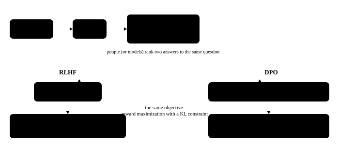

# Training frameworks and reinforcement-learning training systems

<p class="lead">The ten chapters so far implemented each kind of parallelism from scratch; real training uses frameworks that have assembled them: Megatron-LM, DeepSpeed, and PyTorch's own FSDP2 with torchtitan. This chapter first sets out where each of those frameworks stands and the distributed checkpointing they all depend on; then it turns to reinforcement-learning training, which ties a training framework to an inference engine and is where an inference engineer most often meets the training side. We run a complete GRPO loop from the training side's point of view, then implement the step that goes wrong most often in a reinforcement-learning system: resharding the training side's partitioned weights into the inference engine's layout.</p>

!!! question "Self-test: if you can answer these, skip the chapter"
    1. How do Megatron-LM, DeepSpeed and FSDP2 / torchtitan differ in what they are for?
    2. Why can a distributed checkpoint be saved on 4 cards and loaded on 2?
    3. Which steps does one GRPO training step contain, seen from the training side? Why does the training side recompute the log probabilities?
    4. With TP=2 on the training side and TP=4 with a fused `qkv_proj` on the inference side, how are the weights converted? What is the easiest mistake to make?
    5. Why do reinforcement-learning frameworks generally use a single controller to orchestrate?

??? success "Answers for the self-test (answer first, then open this)"
    1. Megatron-LM (Megatron-Core): the standard for large-scale pretraining, with the most complete tensor, pipeline, context and expert parallelism. DeepSpeed: strongest on ZeRO and offloading. FSDP2 / torchtitan: PyTorch's own combination, built on DTensor and easy to modify and compose.
    2. A distributed checkpoint has each rank write only its own shard plus metadata describing which segment of which tensor each shard is; on loading, it repartitions by the metadata and the new parallel layout, so saving and loading can use different card counts.
    3. Synchronise the weights to the inference side, roll out the answers, score them, normalise within the group to get the advantage, recompute the log probabilities on the training side, and update with a clipped objective. The recomputation is because the inference side (different kernels, batching and precision) produces probabilities that differ from the training side's, so the gradient has to use the training side's own probabilities, with the ratio between the two used for an importance correction.
    4. Assemble the complete logical weights from the training side's partition first (or compute the mapping directly), then partition them the inference side's way for TP=4; a fused `qkv_proj` has to be split into q, k and v, partitioned separately, and concatenated back. The commonest mistake is to assemble then partition, slicing the fused weights by row so that the q, k and v boundaries are misaligned, with the shapes still matching and the error silent.
    5. One reinforcement-learning step orchestrates many roles (inference, training, reward, the reference model), each of which is its own multi-card SPMD program; a single controller has one central process schedule those worker groups in sequence, so the logic reads like a single-machine program while the parallelism within each group is kept.

## A map of the training frameworks {#训练框架地图}

| Framework | What it is for | Parallelism | Suits |
| --- | --- | --- | --- |
| **Megatron-LM / Megatron-Core** (NVIDIA) | the de facto standard for large-scale pretraining; Megatron-Core is the reusable library that NeMo and others build on | tensor plus sequence parallelism, interleaved 1F1B pipelines, context parallelism, expert parallelism (MoE parallel folding), the distributed optimizer (ZeRO-1); FP8 through Transformer Engine | over a hundred billion parameters on thousands of cards; the model has to be written in its modules |
| **DeepSpeed** (Microsoft) | the original implementation of ZeRO, well integrated with the HuggingFace ecosystem | ZeRO-1/2/3, CPU and NVMe offload (ZeRO-Offload, ZeRO-Infinity), pipelines, Ulysses sequence parallelism | fine-tuning, mid-scale training, offloading when memory is tight |
| **PyTorch native: FSDP2 plus torchtitan** | PyTorch's own distributed stack; torchtitan is the reference implementation that composes them | FSDP2 (built on DTensor), `parallelize_module` for tensor parallelism, `torch.distributed.pipelining` for pipelines, experimental context parallelism; works with `torch.compile` and Float8 training | staying in native PyTorch with the fewest changes to the model code |
| **HF Transformers Trainer / Accelerate / TRL** | a high-level training loop calling FSDP or DeepSpeed underneath | whatever the backend gives | quick experiments in fine-tuning and post-training |

These frameworks correspond conceptually to this book's chapters exactly: Megatron's `ColumnParallelLinear` and `RowParallelLinear` are the $f$ and $g$ operators from [Tensor parallelism](../model/tensor-sequence.md), the distributed optimizer is [ZeRO-1](../data/zero-fsdp.md), and DeepSpeed's ZeRO-3 and FSDP do the same thing. What really matters in choosing is which kinds of parallelism the model's scale needs, how much model rewriting the team will pay for performance, and how easily it connects to what comes downstream (the inference engine, the reinforcement-learning framework).

## Distributed checkpoints and resharding {#分布式-checkpoint-与重新切分}

A large model's checkpoint cannot have rank 0 gather the complete weights and write them: a 70B model's states are 1 TB. Every framework uses a **distributed checkpoint**: each rank writes only its own shard, plus metadata recording each tensor's global shape and where each shard sits in which file. On loading, each rank computes which part of the global tensor it needs from the metadata and reads it out of the corresponding file. So saving and loading can use **different parallel layouts**, which is what changing the card count mid-training, going from pretraining to fine-tuning, and exporting for inference all rely on.

PyTorch's implementation is `torch.distributed.checkpoint` (DCP), and Megatron's `dist_checkpointing` works the same way. First save with 4 processes and a 4-way FSDP partition:

```python title="dcp_save.py" torchrun="4"
import os

import torch
import torch.distributed as dist
import torch.distributed.checkpoint as dcp
from torch.distributed.device_mesh import init_device_mesh
from torch.distributed.fsdp import fully_shard

dist.init_process_group("gloo")
rank, world = dist.get_rank(), dist.get_world_size()


def make_model():
    torch.manual_seed(0)
    return torch.nn.Sequential(torch.nn.Linear(64, 256), torch.nn.GELU(), torch.nn.Linear(256, 64))


model = make_model()
fully_shard(model, mesh=init_device_mesh("cpu", (world,)))      # a 4-way partition: each parameter cut into 4 slices along dimension 0
dcp.save({"model": model.state_dict()}, checkpoint_id="ckpt")   # each rank writes only its own shard, plus metadata

if rank == 0:
    print(f"{world} 个 rank 保存，第一层权重每片 {tuple(model[0].weight.to_local().shape)}")
    print("checkpoint 目录：", sorted(os.listdir("ckpt")))
dist.destroy_process_group()
```

```text title="output"
4 个 rank 保存，第一层权重每片 (64, 64)
checkpoint 目录： ['.metadata', '__0_0.distcp', '__1_0.distcp', '__2_0.distcp', '__3_0.distcp']
```

Then load the same checkpoint with 2 processes and a 2-way partition, and merge it offline into an ordinary `state_dict`:

```python title="dcp_load.py" torchrun="2"
import torch
import torch.distributed as dist
import torch.distributed.checkpoint as dcp
from torch.distributed.checkpoint.format_utils import dcp_to_torch_save
from torch.distributed.device_mesh import init_device_mesh
from torch.distributed.fsdp import fully_shard

dist.init_process_group("gloo")
rank, world = dist.get_rank(), dist.get_world_size()


def make_model(seed):
    torch.manual_seed(seed)
    return torch.nn.Sequential(torch.nn.Linear(64, 256), torch.nn.GELU(), torch.nn.Linear(256, 64))


ref = make_model(0)                                             # the model as it was when saved
model = make_model(1)                                           # deliberately initialised differently: the parameters have to come from the load
fully_shard(model, mesh=init_device_mesh("cpu", (world,)))      # switched to a 2-way partition
state = {"model": model.state_dict()}
dcp.load(state, checkpoint_id="ckpt")                           # find the part each shard needs from the metadata and read it in place
model.load_state_dict(state["model"])

same = all(torch.equal(p.full_tensor(), q) for p, q in zip(model.parameters(), ref.parameters()))
if rank == 0:
    print(f"{world} 个 rank 加载，第一层权重每片 {tuple(model[0].weight.to_local().shape)}，与原模型一致：{same}")
    dcp_to_torch_save("ckpt", "full.pt")                        # merge offline into an ordinary state_dict, for conversion to an inference format
    full = torch.load("full.pt")["model"]
    print("合并后的完整权重：", {k: tuple(v.shape) for k, v in full.items()})
dist.destroy_process_group()
```

```text title="output"
2 个 rank 加载，第一层权重每片 (128, 64)，与原模型一致：True
合并后的完整权重： {'0.weight': (256, 64), '0.bias': (256,), '2.weight': (64, 256), '2.bias': (64,)}
```

Exporting for an inference engine takes one more step, **format conversion**: Megatron's parameter names and fusions (interleaving Q, K and V in one tensor, say) differ from the HuggingFace format, so the names have to be mapped and the tensors split or concatenated before saving as safetensors. The inference engine then fuses and partitions them its own way on loading, which is exactly what the reinforcement-learning weight synchronisation below has to do online.

## One reinforcement-learning step from the training side {#从训练端看-rl-的一步}

{.aig-svg}

The algorithms are in [Post-training](llm://training/post-training/#推理模型用可验证的奖励做强化学习) in the large-model handbook, and the inference engine's side of it in [Inference in reinforcement-learning training](serving://topics/rl-rollout/) in the inference-systems handbook. Here is what one GRPO step does from the training side, strung together in a minimal example: a language model that looks only at the previous token, with the task that every token should equal the previous one plus 1; the inference engine's stand-in samples with bf16 weights while the training side keeps fp32 master weights:

```python title="grpo_toy.py"
import torch

V, T, G, PROMPTS = 16, 6, 8, 32          # the vocabulary size, the generation length, the samples per prompt (GRPO's group), the prompts per step


class Policy(torch.nn.Module):
    """最小的"语言模型"：下一个 token 只看上一个 token"""

    def __init__(self):
        super().__init__()
        self.emb = torch.nn.Embedding(V, 32)
        self.head = torch.nn.Linear(32, V)

    def forward(self, tok):
        return self.head(torch.tanh(self.emb(tok)))


def reward(prompts, seq):
    """规则奖励：每个"等于上一个 token + 1"的位置得分，满分 1"""
    prev = torch.cat([prompts[:, None], seq[:, :-1]], 1)
    return (seq == (prev + 1) % V).float().mean(1)


class Engine:
    """推理引擎的替身：bf16 权重，只负责采样，并顺手返回每个 token 的 logprob"""

    def __init__(self):
        self.model = Policy().to(torch.bfloat16)

    def load_weights(self, state):
        self.model.load_state_dict(state)                 # weight synchronisation: fp32 master weights to bf16 inference weights

    @torch.no_grad()
    def generate(self, prompts, gen):
        tok, logps = prompts[:, None], []
        for _ in range(T):
            lp = self.model(tok[:, -1]).float().log_softmax(-1)
            nxt = torch.multinomial(lp.exp(), 1, generator=gen)
            logps.append(lp.gather(1, nxt))
            tok = torch.cat([tok, nxt], 1)
        return tok[:, 1:], torch.cat(logps, 1)


def token_logp(model, prompts, seq):
    inp = torch.cat([prompts[:, None], seq[:, :-1]], 1)
    return model(inp).log_softmax(-1).gather(2, seq[..., None]).squeeze(-1)


torch.manual_seed(0)
gen = torch.Generator().manual_seed(0)
policy, engine = Policy(), Engine()
opt = torch.optim.Adam(policy.parameters(), lr=1e-2)
for step in range(1, 41):
    engine.load_weights(policy.state_dict())                              # 1. synchronise the weights
    prompts = torch.randint(0, V, (PROMPTS,), generator=gen).repeat_interleave(G)
    seq, engine_logp = engine.generate(prompts, gen)                      # ② rollout
    r = reward(prompts, seq).view(PROMPTS, G)                             # 3. score
    adv = ((r - r.mean(1, keepdim=True)) / (r.std(1, keepdim=True) + 1e-6)).view(-1, 1)   # 4. the group-relative advantage
    with torch.no_grad():
        old_logp = token_logp(policy, prompts, seq)                       # 5. the training side recomputes the old log probabilities
    for _ in range(2):                                                    # 6. a PPO-style clipped update, each batch used twice
        ratio = (token_logp(policy, prompts, seq) - old_logp).exp()
        loss = -torch.min(ratio * adv, ratio.clamp(0.8, 1.2) * adv).mean()
        opt.zero_grad()
        loss.backward()
        opt.step()
    if step % 8 == 0 or step == 1:
        gap = (engine_logp - old_logp).abs()
        print(f"step {step:>2}：平均奖励 {r.mean():.2f}，推理引擎与训练端的 logprob 差：平均 {gap.mean():.4f}，最大 {gap.max():.4f}")
```

```text title="output"
step  1：平均奖励 0.07，推理引擎与训练端的 logprob 差：平均 0.0008，最大 0.0032
step  8：平均奖励 0.38，推理引擎与训练端的 logprob 差：平均 0.0020，最大 0.0081
step 16：平均奖励 0.83，推理引擎与训练端的 logprob 差：平均 0.0010，最大 0.0172
step 24：平均奖励 0.98，推理引擎与训练端的 logprob 差：平均 0.0004，最大 0.0217
step 32：平均奖励 0.99，推理引擎与训练端的 logprob 差：平均 0.0001，最大 0.0185
step 40：平均奖励 1.00，推理引擎与训练端的 logprob 差：平均 0.0001，最大 0.0393
```

The six numbered steps are the six stages in a real system, and each becomes a systems problem on a large model:

- **1. Synchronising the weights**: a real model is tens to hundreds of gigabytes, and the training and inference sides partition it differently (the next section).
- **2. The rollout**: most of a step's time, where a long tail of answers leaves the GPU running a very small batch most of the time.
- **3. Scoring**: a mathematics problem compares the answer by rule, a code problem runs tests in a sandbox, an agent task interacts with an environment over several turns. These are usually separate services that are CPU-bound or I/O-bound.
- **4. The advantage**: GRPO uses the group's mean as the baseline, doing away with PPO's value model (the critic); the price is sampling $G$ answers per prompt, and a group that is all right or all wrong has an advantage of 0 and no learning signal.
- **5. Recomputing the log probabilities**: the training side does one forward pass over all of the answers. Even with identical weights, the inference engine's numbers differ from the training side's. The largest gap above actually grows later in training: the policy becomes more certain, the logits grow, and bf16's relative error becomes a larger absolute one. With a real model, long sequences and different kernels the difference is far larger (the inference-systems handbook measures a 0.6B model where one token's probability can differ by 10% in bf16), so the PPO ratio's denominator has to use the training side's recomputed value, with the inference side's returned log probability used for an importance-sampling correction; with a KL penalty, the reference model does another forward pass as well.
- **6. The update**: the content of the previous ten chapters, FSDP's or Megatron's forward pass, backward pass and optimizer step.

## Resharding the weights {#权重的重新切分}

The training and inference sides almost always partition the same model differently: the training side may be FSDP (flattened and partitioned by parameter) or Megatron's TP=2 x PP=4, while the inference side is TP=8 with `qkv_proj` and `gate_up_proj` fused and possibly expert parallelism. Every synchronisation has to convert the former into the latter.

Here is an attention layer with grouped-query attention: the training side is Megatron-style TP=2 (Q, K and V stored separately, each partitioned by head) and the inference side is vLLM / SGLang style, with Q, K and V fused into one matrix and then partitioned by TP; there are only 2 KV heads, so at TP=4 on the inference side each KV head has to be **replicated** onto 2 ranks:

```python title="weight_sync.py"
import torch

torch.manual_seed(0)
H, HEADS, KV_HEADS, D = 64, 8, 2, 8               # the hidden dimension, the Q head count, the KV head count (grouped-query attention), the head dimension
GROUP = HEADS // KV_HEADS                         # each KV head serves 4 Q heads
Wq, Wk, Wv = torch.randn(HEADS * D, H), torch.randn(KV_HEADS * D, H), torch.randn(KV_HEADS * D, H)
Wo = torch.randn(H, HEADS * D)
x = torch.randn(5, H)


def attention(q, k, v):
    """q: [T, 头数, D]，k/v: [T, KV 头数, D]；每 GROUP 个 Q 头共用一个 KV 头"""
    rep = q.shape[1] // k.shape[1]
    k, v = k.repeat_interleave(rep, 1), v.repeat_interleave(rep, 1)
    s = torch.einsum("thd,shd->hts", q, k) / D**0.5
    s = s.masked_fill(torch.ones(len(q), len(q)).triu(1).bool(), float("-inf"))
    return torch.einsum("hts,shd->thd", s.softmax(-1), v).reshape(len(q), -1)


ref = attention((x @ Wq.T).view(5, HEADS, D), (x @ Wk.T).view(5, KV_HEADS, D), (x @ Wv.T).view(5, KV_HEADS, D)) @ Wo.T

# ---- the training side: Megatron-style TP=2, with q, k and v each partitioned by head (column parallel) and o by the input dimension (row parallel)
TRAIN_TP = 2
train = [dict(q=Wq.chunk(TRAIN_TP)[r], k=Wk.chunk(TRAIN_TP)[r], v=Wv.chunk(TRAIN_TP)[r], o=Wo.chunk(TRAIN_TP, 1)[r])
         for r in range(TRAIN_TP)]


def gather(name, dim=0):
    return torch.cat([t[name] for t in train], dim)      # step 1: assemble the training side's shards back into the complete weights


# ---- the inference side: q, k and v fused into one qkv_proj and partitioned by TP; with fewer KV heads than the TP degree, each KV head is replicated onto several ranks
def reshard(tp):
    q, k, v, o = gather("q"), gather("k"), gather("v"), gather("o", 1)
    q_per, kv_per = HEADS // tp, max(1, KV_HEADS // tp)
    shards = []
    for r in range(tp):
        h0 = r * q_per
        kv0 = h0 // GROUP                                 # the first KV head corresponding to these Q heads
        shards.append(dict(qkv=torch.cat([q[h0 * D:(h0 + q_per) * D], k[kv0 * D:(kv0 + kv_per) * D],
                                          v[kv0 * D:(kv0 + kv_per) * D]]),
                           o=o[:, h0 * D:(h0 + q_per) * D]))
    return shards


def reshard_naive(tp):
    qkv = torch.cat([gather("q"), gather("k"), gather("v")])      # assemble the complete qkv first, then split it evenly by row
    return [dict(qkv=w, o=o) for w, o in zip(qkv.chunk(tp), gather("o", 1).chunk(tp, 1))]


def infer_forward(shards):
    tp = len(shards)
    q_per, kv_per = HEADS // tp, max(1, KV_HEADS // tp)
    out = 0
    for w in shards:                                              # each rank computes its own heads, then an all-reduce (simply summed here)
        q, k, v = (x @ w["qkv"].T).split([q_per * D, kv_per * D, kv_per * D], -1)
        out = out + attention(q.view(5, q_per, D), k.view(5, kv_per, D), v.view(5, kv_per, D)) @ w["o"].T
    return out


for tp in (2, 4):
    for name, fn in (("正确", reshard), ("朴素", reshard_naive)):
        try:
            err = f"最大误差 {(infer_forward(fn(tp)) - ref).abs().max():.1e}"
        except RuntimeError:
            err = "形状对不上，报错"
        print(f"推理 TP={tp}，{name}的重切分：{err}")

for r in range(4):                                                # each inference rank needs the data of only one training rank: it can be sent point-to-point
    heads = range(r * 2, r * 2 + 2)
    src = sorted({h // (HEADS // TRAIN_TP) for h in heads})
    print(f"推理 rank {r} ← 训练 rank {src}：Q 头 {heads[0]}～{heads[-1]}，KV 头 {heads[0] // GROUP}")
```

```text title="output"
推理 TP=2，正确的重切分：最大误差 4.6e-05
推理 TP=2，朴素的重切分：最大误差 3.2e+02
推理 TP=4，正确的重切分：最大误差 6.1e-05
推理 TP=4，朴素的重切分：形状对不上，报错
推理 rank 0 ← 训练 rank [0]：Q 头 0～1，KV 头 0
推理 rank 1 ← 训练 rank [0]：Q 头 2～3，KV 头 0
推理 rank 2 ← 训练 rank [1]：Q 头 4～5，KV 头 1
推理 rank 3 ← 训练 rank [1]：Q 头 6～7，KV 头 1
```

A few key points:

- **A fused weight cannot be assembled and then partitioned**: each tensor-parallel shard of the fused matrix is "this rank's Q heads plus the matching K heads plus the matching V heads", not a contiguous segment of the complete matrix. At TP=2 the naive approach happens to produce matching shapes and a completely wrong result, with no error raised. A bug like this shows up in reinforcement learning as a reward that will not rise, or gibberish from the rollout, and is hard to locate directly. The same goes for `gate_up_proj`. Every layer in an inference engine has its own `weight_loader` to handle these mappings, and that is what a reinforcement-learning framework calls.
- **Replicating KV heads under grouped-query attention**: when the inference tensor-parallel degree exceeds the KV head count, the KV heads have to be replicated onto several ranks; the training side has no such replication, so the conversion has to follow the mapping.
- **No need to gather first**: the last four lines show that each inference rank's data comes from exactly one training rank. Sending point-to-point by the mapping means no complete weight ever has to be assembled anywhere, which is the direction large systems (especially disaggregated ones) optimise toward.
- **Quantised inference**: if the inference side uses FP8, each synchronisation also has to quantise online (recomputing the scaling factors).

The synchronisation cost can be estimated roughly: a 70B model's bf16 weights are 141 GB. Colocated, training and inference share the cards, the tensors are gathered by layer and handed to the inference process as CUDA IPC handles, and the data moves only over NVLink and within device memory inside the node. Disaggregated, with inference at TP=8, each card has to receive $141 / 8 \approx 17.6$ GB, which over a 50 GB/s network card takes at least 0.35 seconds, and every inference instance needs a copy. That calls for a broadcast tree or a pipelined transfer, overlapped with the next round's rollout.

## Colocated or disaggregated {#共置还是分离}

| | Colocated (the same cards, training and inference taking turns) | Disaggregated (separate cards for training and inference) |
| --- | --- | --- |
| Utilization | both phases use every card fully | the card counts have to be proportioned to the load, and getting it wrong leaves one side idle |
| Switching cost | memory has to be freed every step: the inference engine releases the KV cache (sleep) and the training side offloads the optimizer states or even the parameters to the CPU | none |
| Weight synchronisation | same machine, CUDA IPC, fast | cross-machine transfer, needing RDMA or an NCCL broadcast |
| Parallel layout | each side picks its own best layout, but they share the same card count | the two sides can use entirely different card counts and layouts |
| Synchronous or asynchronous | naturally synchronous (on-policy) | the rollout and the training can be pipelined (asynchronous, off-policy), with the policy's lag bounded and corrected |

Colocation costs mainly the switching: the training side's model states and activations cannot be resident at the same time as the inference side's weights and KV cache. Disaggregation costs the proportioning and the synchronisation: a slow rollout leaves the training side waiting and slow training leaves the inference side waiting, which is where asynchronous reinforcement learning comes from. The inference side generates continuously, the training side updates once it has a batch, and the inference side takes on the new weights mid-generation.

## The structure of a reinforcement-learning framework {#rl-框架的结构}

Reinforcement-learning training has several models (the actor, the reference model, plus a critic and a reward model under PPO), several stages, and two kinds of engine. Pure SPMD (every rank running the same script, as in this book's torchrun examples) struggles to orchestrate that many roles, so the mainstream frameworks all use a **single controller**: a driver process (usually built on Ray) calls each worker group's methods in sequence and passes the data between them, while each worker group is still SPMD inside (FSDP, Megatron, the inference engine's tensor-parallel group). The algorithm's logic lives in the driver process and reads like a single-machine program; the distributed details are encapsulated in the worker groups.

| Framework | Training backend | Inference backend | Characteristics |
| --- | --- | --- | --- |
| **verl** | FSDP / FSDP2, Megatron | vLLM, SGLang | HybridFlow: a single controller orchestrating SPMD worker groups; colocated by default (a hybrid engine) that switches between training and inference on the same cards and reshards internally |
| **OpenRLHF** | DeepSpeed | vLLM | built on Ray, with the actor, critic, reference model and reward model placeable separately or colocated |
| **slime** | Megatron | SGLang | a lightweight framework connecting Megatron training to SGLang rollout directly, supporting colocated and disaggregated, synchronous and asynchronous |
| **AReaL** | FSDP, Megatron | SGLang, vLLM | fully asynchronous: the rollout does not wait for training and can be interrupted mid-generation to take new weights; training corrects by each sample's lag |
| **TRL** | Accelerate (FSDP / DeepSpeed) | vLLM (optional) | HuggingFace's post-training library, with `GRPOTrainer` and others, suiting small and mid-scale work |

What these frameworks ask of an inference engine, returning the log probabilities at sampling time, releasing and restoring device memory, updating weights online, interrupting and resuming requests, and deterministic sampling, is discussed item by item in [Inference in reinforcement-learning training](serving://topics/rl-rollout/) in the inference-systems handbook.

!!! interview "How to explain it"
    On reinforcement-learning training systems: a GRPO step is synchronise the weights, roll out, score, compute the group-relative advantage, recompute the log probabilities on the training side, and update with clipping; the recomputation is because the inference and training sides' numbers differ, which the recomputation and importance sampling correct for. Sending the weights from the training side to the inference side has to handle fused weights (`qkv_proj`, `gate_up_proj`), replicating KV heads under grouped-query attention and different tensor-parallel degrees; assembling then partitioning fails silently, and sending point-to-point by the mapping avoids any gathering. On deployment: colocation saves cards and simplifies synchronisation but has to swap memory; disaggregation allows asynchrony and free layouts but has to synchronise weights across machines. At the framework level, be clear about where Megatron-Core, DeepSpeed and FSDP2 each stand, and that reinforcement-learning frameworks orchestrate several SPMD worker groups from a single controller.

## Exercises {#练习}

1. Building on `weight_sync.py`, write the resharding of an MLP's `gate_up_proj` from TP=2 on the training side to TP=4 on the inference side. What is wrong with the naive approach?

??? success "Answer"
    The inference side's rank $r$ shard of `gate_up_proj` should be `cat([gate's r-th slice, up's r-th slice])`, where the r-th slice comes from partitioning `gate` and `up` separately along their output (intermediate) dimension into 4:

    ```python
    gate, up = gather("gate"), gather("up")                  # assemble back to [I, H] first
    shards = [torch.cat([g, u]) for g, u in zip(gate.chunk(4), up.chunk(4))]
    ```

    The naive `torch.cat([gate, up]).chunk(4)` gives ranks 0 and 1 nothing but gate and ranks 2 and 3 nothing but up: the shapes match perfectly and the result is wrong, because the two factors multiplied in $\text{SiLU}(\text{gate}) \cdot \text{up}$ no longer correspond. `down_proj` is row-parallel and simply partitions into 4 along the input dimension.

2. Why does the PPO ratio's denominator use the training side's recomputed `old_logp` rather than the `engine_logp` the inference engine returned? And what is the engine's value good for?

??? success "Answer"
    PPO's ratio $\pi_\theta / \pi_{\text{old}}$ measures how much the policy has changed over a few updates, and the clipping is based on it. If the denominator came from the inference side, the ratio would already differ from 1 before any update: the numerical difference between the two would be taken for a change in the policy, and the clipping would act in the wrong places. Recomputing on the training side guarantees the ratio is exactly 1 before the first update.
    The log probability the inference engine returns represents the distribution the samples actually came from. The training and inference distributions differ, which is off-policy in essence, so $\pi_{\text{old}} / \pi_{\text{rollout}}$ provides an importance-sampling correction (usually truncated, as in truncated importance sampling), or samples that differ too much are dropped. The bias from policy lag in asynchronous reinforcement learning is handled the same way.

3. A 7B model doing GRPO on 64 cards. Would you colocate or disaggregate? And for a 600B mixture-of-experts model on thousands of cards?

??? success "Answer"
    7B on 64 cards: **colocate**. The model is small, the training states and the inference KV cache are both easy to move around on an 80 GB card, and the switching cost is low; colocated, every card has work in both phases and no proportioning is needed.
    600B mixture of experts on thousands of cards: **disaggregate** (usually asynchronously). The training side's model states are enormous and offloading and restoring them every step is expensive; the best parallel layouts for training and inference differ greatly (pipeline x expert parallelism for training, large-scale expert parallelism with data-parallel attention for inference), which is hard to reconcile on one set of cards; and the rollout's long tail is worse at this scale, which asynchrony can overlap with the training. The price is needing efficient cross-machine weight synchronisation and a correction for the policy's lag.

## Summary {#小结}

- [x] Megatron-Core is the standard for large-scale pretraining, DeepSpeed is strongest on ZeRO and offloading, and FSDP2 with torchtitan is PyTorch's native combination; their building blocks all correspond to this book's chapters.
- [x] A distributed checkpoint has each rank write its own shard plus metadata, and repartitions by that metadata on loading, so saving and loading can use different parallel layouts.
- [x] A GRPO step: synchronise the weights, roll out, score, compute the group-relative advantage, recompute the log probabilities on the training side, update with clipping; the numerical difference between the training and inference sides is handled by the recomputation and importance sampling.
- [x] Converting weights from the training side to the inference side has to handle fused weights, replicated KV heads under grouped-query attention and different tensor-parallel degrees; assembling then partitioning fails silently, and sending point-to-point by the mapping avoids any gathering.
- [x] Colocation saves cards and simplifies synchronisation but has to swap memory; disaggregation allows asynchrony and free layouts but has to synchronise weights across machines. Reinforcement-learning frameworks orchestrate several SPMD worker groups from a single controller.
