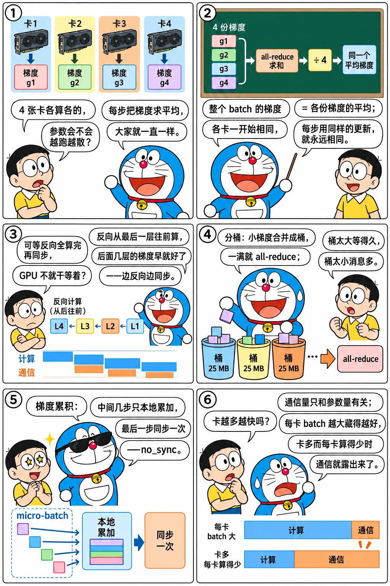

# 数据并行与 DDP：分桶与通信重叠

<p class="lead">数据并行是最简单、也是用得最多的并行：每张卡放一份完整的模型，处理不同的数据，反向之后把梯度求平均。难点不在"求平均"，而在"怎么让通信不拖慢训练"。这一章从零写一个 DDP：梯度分桶、在反向过程中异步 all-reduce、与计算重叠，并在 2 个进程上验证它与单进程训练逐步一致。</p>

!!! question "自测：能答上来就可以跳过本章"
    1. 每张卡在自己的数据上算平均损失再反向，梯度 all-reduce 求平均之后，为什么等价于在整个 batch 上训练？
    2. 为什么不在反向全部结束之后再一次性同步所有梯度？
    3. 梯度"分桶"解决什么问题？桶太大、太小各有什么问题？
    4. 梯度累积时，为什么中间的几个 micro-step 不需要同步？
    5. 数据并行的扩展效率由什么决定？

??? success "自测参考答案（先自己答，再展开对照）"
    1. 整个 batch 的平均损失对参数的梯度，等于各份数据平均损失的梯度再取平均（每份大小相同时）；各卡参数一开始相同、每步用同样的平均梯度更新，所以一直保持一致，等价于在整个 batch 上训练。
    2. 反向是从最后一层往前算的，后面几层的梯度早就算好了；等全部结束再同步，通信就完全暴露在关键路径上。边反向边同步，可以把大部分通信藏到还没算完的反向计算后面。
    3. 把很多个小梯度张量合并成较大的桶再做 all-reduce，减少通信次数和固定开销，同时桶一满就能开始通信。桶太大：要等很久才满，重叠的机会少，最后一个桶暴露的时间长；桶太小：通信次数多，每次的延迟开销占比高。
    4. 中间几步只是在本地累加梯度，最后一步才更新参数；只要在最后一步把累加好的梯度同步一次，结果就和每步都同步完全一样，省掉了中间的通信（`no_sync`）。
    5. 每张卡的计算时间与梯度通信时间之比：通信量只和参数量有关、是固定的，每张卡的 batch 越大（计算越多）、通信被藏得越好，效率越高；卡数多、每卡 batch 小时效率下降。

先看一个六格小剧场，再读正文：

{.aig-comic}

## 为什么求平均就等价

设全局 batch 有 $B$ 条样本，均分给 $n$ 张卡。第 $k$ 张卡算的是自己那 $B/n$ 条的平均损失 $L_k$，全局平均损失 $L = \frac{1}{n}\sum_k L_k$。梯度是线性的，所以

$$\nabla L = \frac{1}{n}\sum_k \nabla L_k$$

——每张卡算自己的梯度，all-reduce 求和再除以 $n$，就得到和单卡训练整个 batch 完全相同的梯度。之后每张卡用相同的梯度做相同的更新，参数始终保持一致（前提是初始参数一致：开始时从 rank 0 广播一次）。

## 通信与反向重叠

最朴素的实现是等反向全部结束，再对每个参数的梯度做一次 all-reduce。两个问题：

- **通信全部暴露**：反向结束之后网卡才开始工作，GPU 等着；
- **小消息太多**：一个模型有几百个参数张量，每个都单独 all-reduce，延迟项（上一章的 $\alpha$）会积少成多。

DDP 的做法是：

1. 反向传播大致按"从最后一层到第一层"的顺序产生梯度；把参数按这个顺序分成若干个**桶**（PyTorch 默认每桶 25 MB）；
2. 给每个参数注册一个钩子，梯度算好时通知 DDP；某个桶的梯度全部到齐，就**立即异步发起**这个桶的 all-reduce；
3. 反向继续计算前面的层，同时网卡在传后面的层的梯度；
4. 优化器更新之前，等所有桶的通信完成。

于是大部分通信被藏在反向计算后面，只有最后一个桶（第一层的梯度）的通信会暴露出来。

拨一拨层数、桶大小和带宽，看暴露出来的通信有多少：

<div class="aig-widget" data-widget="ddp-overlap"></div>

## 从零实现

```python title="my_ddp.py"
import torch
import torch.distributed as dist


class MyDDP(torch.nn.Module):
    """从零实现的数据并行：梯度按反向的顺序分桶，桶满就异步 all-reduce，与剩下的反向计算重叠。"""

    def __init__(self, module, bucket_bytes=64 * 1024):
        super().__init__()
        self.module = module
        self.world = dist.get_world_size()
        for p in module.parameters():                       # 所有 rank 从同样的初始参数开始
            dist.broadcast(p.data, src=0)
        params = [p for p in module.parameters() if p.requires_grad][::-1]   # 反向时大致按逆序产生梯度
        self.buckets, cur, size = [], [], 0
        for p in params:
            cur.append(p)
            size += p.numel() * p.element_size()
            if size >= bucket_bytes:
                self.buckets.append(cur)
                cur, size = [], 0
        if cur:
            self.buckets.append(cur)
        self.bucket_of = {p: i for i, b in enumerate(self.buckets) for p in b}
        self.pending, self.launched_in_backward = {}, 0
        for p in params:
            p.register_post_accumulate_grad_hook(self._on_grad_ready)

    def forward(self, *args):
        self.ready = [0] * len(self.buckets)
        self.handles = []
        return self.module(*args)

    def _on_grad_ready(self, p):
        i = self.bucket_of[p]
        self.ready[i] += 1
        if self.ready[i] == len(self.buckets[i]):           # 桶里的梯度都到齐了：立刻发起异步 all-reduce
            flat = torch.cat([q.grad.flatten() for q in self.buckets[i]])
            self.handles.append((dist.all_reduce(flat, async_op=True), flat, i))
            self.launched_in_backward += 1

    def finish_gradient_sync(self):
        for work, flat, i in self.handles:                  # 优化器更新之前，等所有桶完成
            work.wait()
            flat /= self.world
            offset = 0
            for q in self.buckets[i]:
                q.grad.copy_(flat[offset:offset + q.numel()].view_as(q.grad))
                offset += q.numel()
```

- `register_post_accumulate_grad_hook`（PyTorch 2.1 起）在梯度累加到 `.grad` 之后调用，正好是"这个参数的梯度好了"的时机；
- `async_op=True` 让 `all_reduce` 立刻返回一个句柄，通信在后台进行；`wait()` 才阻塞；
- 桶里的梯度先拼成一个连续的大张量（`torch.cat`）再通信，拼接本身有一次拷贝。PyTorch 的 DDP 更进一步：让每个桶的梯度一开始就分配在一块连续的缓冲区里（`gradient_as_bucket_view`），省掉这次拷贝。

用两个进程训练 3 步，和"单进程在完整 batch 上训练"以及 PyTorch 自带的 DDP 对比：

```python title="ddp_check.py" torchrun="2"
import torch
import torch.distributed as dist

from my_ddp import MyDDP

dist.init_process_group("gloo")
rank, world = dist.get_rank(), dist.get_world_size()


def make_model():
    torch.manual_seed(0)
    return torch.nn.Sequential(torch.nn.Linear(64, 256), torch.nn.GELU(), torch.nn.Linear(256, 256), torch.nn.GELU(),
                               torch.nn.Linear(256, 10))


torch.manual_seed(123)
X, Y = torch.randn(32, 64), torch.randint(0, 10, (32,))   # 全局 batch：32 条样本
local = slice(rank * 32 // world, (rank + 1) * 32 // world)   # 每个 rank 拿自己的一份

ref = make_model()                                          # 单进程参照：用完整 batch 训练
ddp = MyDDP(make_model())
official = torch.nn.parallel.DistributedDataParallel(make_model())   # PyTorch 自带的 DDP，作为对照
opt_ref = torch.optim.SGD(ref.parameters(), lr=0.1)
opt = torch.optim.SGD(ddp.parameters(), lr=0.1)
opt_off = torch.optim.SGD(official.parameters(), lr=0.1)
loss_fn = torch.nn.CrossEntropyLoss()

for step in range(3):
    opt_ref.zero_grad()
    loss_fn(ref(X), Y).backward()
    opt_ref.step()

    opt.zero_grad()
    loss = loss_fn(ddp(X[local]), Y[local])                # 每个 rank 只算自己那份数据的平均损失
    loss.backward()
    ddp.finish_gradient_sync()                              # 梯度求平均：等价于对全局 batch 求平均
    opt.step()

    opt_off.zero_grad()
    loss_fn(official(X[local]), Y[local]).backward()        # 官方 DDP 在反向里自动同步
    opt_off.step()

def max_diff(m):
    return max((a - b).abs().max().item() for a, b in zip(ref.parameters(), m.parameters()))


if rank == 0:
    print(f"{world} 个 rank，{len(ddp.buckets)} 个梯度桶，每步在反向过程中发起 {ddp.launched_in_backward // 3} 次 all-reduce")
    print("训练 3 步后，自己写的 DDP 与单进程一致：", max_diff(ddp.module) < 1e-6)
    print("训练 3 步后，官方 DDP 与单进程一致：", max_diff(official.module) < 1e-6)
dist.destroy_process_group()
```

```text title="输出"
2 个 rank，2 个梯度桶，每步在反向过程中发起 2 次 all-reduce
训练 3 步后，自己写的 DDP 与单进程一致： True
训练 3 步后，官方 DDP 与单进程一致： True
```

## 实践中的细节

**梯度累积**：显存只够放很小的 micro-batch 时，连续做几次前向反向、把梯度累加起来再更新。中间几次的梯度不需要同步——只在最后一次反向时 all-reduce 累加好的梯度，通信量减少为 1/累积步数。PyTorch 的 DDP 用 `with model.no_sync():` 包住中间几次反向。

**桶的大小**：桶太小，通信次数多、延迟占比高；桶太大，第一个桶要等很久才凑满，重叠的机会变少，最后暴露出来的通信也更长。默认的 25 MB 是经验值，大模型上常调到 50～200 MB。

**降低通信量**：用 bf16 传梯度（`register_comm_hook` 注册压缩钩子）能减半通信量；PowerSGD 这类低秩压缩更激进，但会影响收敛，大模型训练中很少用。

**扩展效率**：每一步的计算量和每张卡的 batch 成正比，通信量却是固定的 $2\Psi$（参数的字节数）量级。卡数增加、每张卡的 batch 变小时，计算变少而通信不变，通信迟早会藏不住——这时要么增大全局 batch（受收敛性限制），要么换用其他并行。

**数据的切分**：每个 rank 读不同的数据，常用 `DistributedSampler` 按 rank 切分数据集，并在每个 epoch 用同一个随机种子打乱，保证各 rank 之间既不重叠也不遗漏。

!!! interview "面试怎么答"
    DDP 题：每张卡算自己数据的平均梯度，all-reduce 求平均，等价于在整个 batch 上训练（开始前要广播初始参数）。不等反向结束再同步，是为了重叠：DDP 按反向的顺序把梯度分桶，一个桶满了就异步 all-reduce，和剩下的反向并行，最后只有一个桶的通信暴露出来；桶太小通信次数多、延迟占比高，太大重叠的机会少。梯度累积的中间几步不用同步（`no_sync`）。扩展效率取决于每张卡的计算量和固定的梯度通信量之比。

## 练习

1. 在 `MyDDP` 里加上梯度累积：`with ddp.no_sync():` 期间的反向只累加梯度、不发起通信；退出之后的下一次反向正常同步。验证"累积 2 步、每步用一半数据"与"一步用全部数据"的结果一致。

??? success "参考要点"
    在 `_on_grad_ready` 开头判断一个 `self.sync_enabled` 标志，`no_sync()` 用 `contextlib.contextmanager` 在进入时置为 `False`、退出时恢复。
    注意损失的缩放：每个 micro-step 的损失要除以累积步数（或者最后把梯度除以累积步数），才等价于一步用全部数据的平均损失。
    PyTorch 的 DDP 在 `no_sync` 下还会跳过桶的准备工作；FSDP 下的对应做法更复杂，因为参数本身是切分的（下一章）。

2. 一个 7B 模型（bf16 梯度约 14 GB）在 64 张卡上做数据并行，节点间每张卡 50 GB/s，每一步的反向计算需要 0.8 秒。梯度同步能被完全藏住吗？

??? success "参考答案"
    环形 all-reduce 每张卡发送约 $2 \times 14 = 28$ GB，在 50 GB/s 上需要约 0.56 秒，比反向的 0.8 秒短，理论上能被藏住——但最后一个桶的通信必然暴露，而且真实的网络利用率达不到 100%，余量并不大。
    这也是为什么大模型训练在数据并行之外总是配合 ZeRO（每步的通信量相同，但显存省下来可以放更大的 batch，让计算时间变长）以及节点内的张量并行（让跨节点的数据并行度变小）。

## 小结

- [x] 数据并行：每张卡算自己数据的梯度，all-reduce 求平均，等价于在整个 batch 上训练；开始前广播初始参数。
- [x] DDP 把梯度按反向顺序分桶，桶满即异步 all-reduce，与剩下的反向重叠；只有最后一个桶的通信暴露。
- [x] 梯度累积只在最后一步同步；桶的大小在"延迟"和"重叠机会"之间折中。
- [x] 扩展效率取决于每张卡的计算量和固定的梯度通信量之比。
