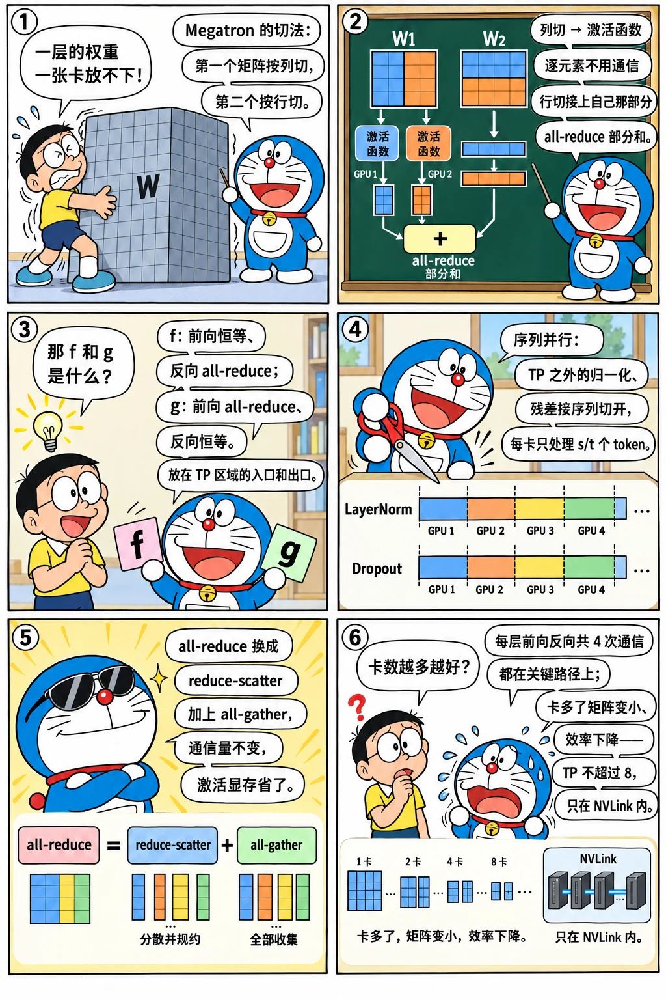

# 张量并行与序列并行

<p class="lead">张量并行（TP）把每一层的权重矩阵切开，分给多张卡同时计算，是训练和推理共用的并行方式。推理系统手册的[张量并行](serving://distributed/tensor-parallel/)讲了推理时的前向；训练还要处理反向：梯度怎么同步、哪些参数的梯度要额外求和。这一章用 4 个自定义的 autograd 函数实现 Megatron-LM 的张量并行和序列并行，并验证前向输出和每个分片的梯度都与单进程一致。</p>

!!! question "自测：能答上来就可以跳过本章"
    1. Megatron 的 MLP 为什么第一个矩阵按列切、第二个按行切？中间需要通信吗？
    2. Megatron 论文里的 `f` 和 `g` 两个算子，前向和反向分别做什么？
    3. 序列并行（SP）切的是什么？它把 all-reduce 换成了什么？通信量变了吗？
    4. 开了序列并行之后，LayerNorm 的权重梯度为什么要额外做一次 all-reduce？
    5. 张量并行每层要通信几次、每次多大？为什么通常不超过 8 张卡？

??? success "自测参考答案（先自己答，再展开对照）"
    1. 第一个矩阵按输出维（列）切，每张卡算出中间结果的一部分列；激活函数逐元素，各算各的，不需要通信；第二个矩阵按输入维（行）切，正好接上自己那部分列，得到的是完整形状的部分和，最后 all-reduce 一次。中间不需要通信。
    2. `f`：前向恒等（每张卡拿同一份输入），反向把各卡对输入的梯度 all-reduce；`g`：前向 all-reduce（部分和相加），反向恒等。它们放在 TP 区域的入口和出口，前向和反向正好互为对方。
    3. 序列并行把 TP 区域之外的 LayerNorm、Dropout、残差这些区域沿序列维切开，每张卡只处理 $s/t$ 个 token。all-reduce 换成了 reduce-scatter（离开 TP 区域）+ all-gather（进入 TP 区域），通信量不变，但这些区域的激活再减少 $t$ 倍。
    4. LayerNorm 的权重被所有序列分片共用，每张卡只算出了自己那段序列贡献的梯度，要在 TP 组内加起来（all-reduce）才是完整的梯度。
    5. 每层前向 2 次（注意力、MLP 各一次）、反向 2 次，每次约 $s \cdot b \cdot h$ 个元素，都在关键路径上。卡数增加时每张卡的矩阵变小、计算效率下降，而通信量不变，所以 TP 只放在 NVLink 域内、通常不超过 8。

先看一个六格小剧场，再读正文：

{.aig-comic}

## Megatron 的切法

{.aig-svg}

一个 MLP 块是 $Y = \text{GELU}(X W_1^\top) W_2^\top$。把 $W_1$ 按**输出维**（FFN 中间维度）切成 $t$ 份、$W_2$ 按**输入维**切成对应的 $t$ 份：

- 每张卡用完整的 $X$ 乘自己那片 $W_1$，得到中间结果的一部分列；GELU 是逐元素的，各算各的，**不需要通信**；
- 每张卡用自己那部分列乘自己那片 $W_2$，得到的是完整形状的**部分和**；把 $t$ 个部分和相加（all-reduce）就是最终结果。

注意力也一样：按头切分 $Q$、$K$、$V$ 的投影（每张卡负责若干个头），输出投影按输入维切，最后 all-reduce。于是每个 Transformer 层的前向有两次 all-reduce（注意力一次、MLP 一次）。

反向时通信的方向正好相反。Megatron 把它们封装成两个"共轭"的算子：

| 算子 | 放在哪里 | 前向 | 反向 |
| --- | --- | --- | --- |
| `f` | 进入 TP 区域时（列切分的矩阵乘之前） | 恒等 | all-reduce（每张卡对输入的梯度只是一部分，要求和） |
| `g` | 离开 TP 区域时（行切分的矩阵乘之后） | all-reduce（部分和相加） | 恒等 |

## 序列并行

TP 区域之外还有 LayerNorm、Dropout、残差相加，它们在每张卡上都是**完整重复**地计算和保存的——激活没有被切分（总论里 TP 不开 SP 时激活是 $sbh(10 + 24/t)$，那个 10 就是它们）。序列并行把这些区域沿**序列维**切开：每张卡只处理 $s/t$ 个 token。于是在两种区域的边界上：

- 进入 TP 区域：需要完整的序列 → **all-gather**（沿序列维）；
- 离开 TP 区域：部分和相加、再切回序列分片 → **reduce-scatter**。

all-reduce 恰好等于 reduce-scatter + all-gather，所以**通信量不变**，但 LayerNorm 等处的激活也被切成了 $1/t$。代价是一个细节：LayerNorm 的权重被各个序列分片共用，每张卡只算出了自己那段序列贡献的梯度，要在 TP 组内再 all-reduce 一次。

## 实现

四个通信算子都是自定义的 `autograd.Function`：

```python title="tp_ops.py"
import torch
import torch.distributed as dist


class CopyToTP(torch.autograd.Function):
    """Megatron 的 f：前向是恒等（每个 rank 拿同一份输入），反向把各 rank 对输入的梯度 all-reduce 求和。"""

    @staticmethod
    def forward(ctx, x):
        return x

    @staticmethod
    def backward(ctx, grad):
        grad = grad.clone()
        dist.all_reduce(grad)
        return grad


class ReduceFromTP(torch.autograd.Function):
    """Megatron 的 g：前向 all-reduce 求和（合并行切分矩阵乘的部分和），反向是恒等。"""

    @staticmethod
    def forward(ctx, x):
        x = x.clone()
        dist.all_reduce(x)
        return x

    @staticmethod
    def backward(ctx, grad):
        return grad


class GatherSeq(torch.autograd.Function):
    """序列并行的 g-bar：前向沿序列维 all-gather（拼回完整序列），反向 reduce-scatter。"""

    @staticmethod
    def forward(ctx, x):
        out = x.new_empty(x.shape[0] * dist.get_world_size(), *x.shape[1:])
        dist.all_gather_into_tensor(out, x.contiguous())
        return out

    @staticmethod
    def backward(ctx, grad):
        out = grad.new_empty(grad.shape[0] // dist.get_world_size(), *grad.shape[1:])
        dist.reduce_scatter_tensor(out, grad.contiguous())
        return out


class ScatterSeq(torch.autograd.Function):
    """序列并行的 f-bar：前向 reduce-scatter（求和并沿序列维切开），反向 all-gather。"""

    @staticmethod
    def forward(ctx, x):
        out = x.new_empty(x.shape[0] // dist.get_world_size(), *x.shape[1:])
        dist.reduce_scatter_tensor(out, x.contiguous())
        return out

    @staticmethod
    def backward(ctx, grad):
        out = grad.new_empty(grad.shape[0] * dist.get_world_size(), *grad.shape[1:])
        dist.all_gather_into_tensor(out, grad.contiguous())
        return out
```

用 LayerNorm + MLP 验证。所有 rank 先生成同样的完整权重和输入，算出单进程的参照结果和梯度；再分别用 TP、TP + SP 计算，比较输出和**每个分片的梯度**：

```python title="tp_mlp_check.py" torchrun="4"
import torch
import torch.distributed as dist
import torch.nn.functional as F

from tp_ops import CopyToTP, GatherSeq, ReduceFromTP, ScatterSeq

dist.init_process_group("gloo")
rank, tp = dist.get_rank(), dist.get_world_size()
S, H, FFN = 8, 16, 64                                   # 序列长度、隐藏维度、FFN 中间维度

torch.manual_seed(0)                                    # 所有 rank 生成同样的完整权重和输入
x_full = torch.randn(S, H)
ln_w = torch.randn(H)
w1 = torch.randn(FFN, H) / H ** 0.5                     # 升维：[FFN, H]
w2 = torch.randn(H, FFN) / FFN ** 0.5                   # 降维：[H, FFN]
cols = slice(rank * FFN // tp, (rank + 1) * FFN // tp)  # 本 rank 负责的 FFN 中间维度
rows = slice(rank * S // tp, (rank + 1) * S // tp)      # 序列并行时本 rank 负责的 token


def block(x, ln_w, w1, w2):                             # 单进程参照：LayerNorm → 升维 → GELU → 降维
    h = F.layer_norm(x, (H,), weight=ln_w)
    return F.linear(F.gelu(F.linear(h, w1)), w2)


ref_in = [t.clone().requires_grad_() for t in (x_full, ln_w, w1, w2)]
ref_out = block(*ref_in)
ref_out.square().sum().backward()
r_x, r_ln, r_w1, r_w2 = (t.grad for t in ref_in)

# ---- 张量并行：w1 按行切（输出列切分），w2 按列切（输入行切分），中间的 GELU 各算各的
x = x_full.clone().requires_grad_()
lw = ln_w.clone().requires_grad_()
w1_s = w1[cols].clone().requires_grad_()
w2_s = w2[:, cols].clone().requires_grad_()
h = CopyToTP.apply(F.layer_norm(x, (H,), weight=lw))    # f
out = ReduceFromTP.apply(F.linear(F.gelu(F.linear(h, w1_s)), w2_s))   # g：部分和相加
out.square().sum().backward()
tp_ok = [torch.allclose(out, ref_out, atol=1e-5), torch.allclose(w1_s.grad, r_w1[cols], atol=1e-5),
         torch.allclose(w2_s.grad, r_w2[:, cols], atol=1e-5), torch.allclose(x.grad, r_x, atol=1e-5)]

# ---- 序列并行：LayerNorm 只处理本 rank 的那一段序列；进入 TP 区域前 all-gather，出来时 reduce-scatter
x = x_full[rows].clone().requires_grad_()
lw = ln_w.clone().requires_grad_()
w1_s = w1[cols].clone().requires_grad_()
w2_s = w2[:, cols].clone().requires_grad_()
h = GatherSeq.apply(F.layer_norm(x, (H,), weight=lw))   # 激活在 LayerNorm 处只有 S/tp 行
out = ScatterSeq.apply(F.linear(F.gelu(F.linear(h, w1_s)), w2_s))
out.square().sum().backward()
dist.all_reduce(lw.grad)                                 # LayerNorm 的权重被各段序列共用：梯度要在 TP 组内求和
sp_ok = [torch.allclose(out, ref_out[rows], atol=1e-5), torch.allclose(x.grad, r_x[rows], atol=1e-5),
         torch.allclose(w1_s.grad, r_w1[cols], atol=1e-5), torch.allclose(lw.grad, r_ln, atol=1e-5)]

flags = torch.tensor([int(all(tp_ok)), int(all(sp_ok))])
dist.all_reduce(flags, op=dist.ReduceOp.MIN)
if rank == 0:
    print(f"TP={tp}：输出、w1 分片梯度、w2 分片梯度、输入梯度都与单进程一致：", bool(flags[0]))
    print(f"TP={tp} + 序列并行：输出分片、输入分片梯度、w1 分片梯度、LayerNorm 权重梯度都一致：", bool(flags[1]))
dist.destroy_process_group()
```

```text title="输出"
TP=4：输出、w1 分片梯度、w2 分片梯度、输入梯度都与单进程一致： True
TP=4 + 序列并行：输出分片、输入分片梯度、w1 分片梯度、LayerNorm 权重梯度都一致： True
```

值得注意的几点：

- 不开 SP 时，`x.grad` 在每个 rank 上都是完整的输入梯度——`f` 的反向把各 rank 的部分梯度加起来了；少了这一步，传给前一层的梯度就是错的；
- 开 SP 时，LayerNorm 的输入、输出都只有 $S/t$ 行，这正是省下的激活；`lw.grad` 的 all-reduce 就是上面说的那个额外步骤，Megatron 里对所有"在序列并行区域里、各 rank 共享"的参数都要这样做；
- `w1`、`w2` 的分片梯度不需要任何通信：每张卡的分片只被自己用到。

## 通信量与规模

每层前向两次 all-reduce（或 SP 下两组 reduce-scatter + all-gather），每次的数据量是 $s \cdot b \cdot h$ 个元素；反向同样两次。它们都在**关键路径**上：下一步计算必须等通信完成。所以：

算一算通信和计算的比例：

<div class="aig-widget" data-widget="tp-comm"></div>

- TP 基本只在 NVLink 连通的一台机器内做，度数通常不超过 8；
- 度数太大时，每张卡上的矩阵变小、计算效率下降，而通信量不变——TP=8 以上很少划算；
- 工程上会把通信和计算重叠：把矩阵乘切成若干块，算一块、传一块（Megatron 的 tp-comm-overlap、各种"通信计算融合"的 GEMM kernel）。

推理时 TP 也是同样的切法（见推理系统手册的[张量并行](serving://distributed/tensor-parallel/)），区别只是没有反向，decode 时每次 all-reduce 的数据很小、被延迟主导。

!!! interview "面试怎么答"
    张量并行必考"手推 Megatron 的切法"：MLP 第一个矩阵按列切、第二个按行切，中间的激活函数逐元素、不用通信，最后 all-reduce 部分和；注意力按头切。`f`（前向恒等、反向 all-reduce）和 `g`（前向 all-reduce、反向恒等）成对出现在 TP 区域两端。序列并行把 LayerNorm、Dropout 这些区域沿序列切开，all-reduce 换成 all-gather + reduce-scatter，通信量不变、激活再减 $t$ 倍，但被各段共享的 LayerNorm 权重，梯度要在 TP 组内再 all-reduce 一次。每层 4 次在关键路径上的通信，决定了 TP 只放在 NVLink 域内、通常不超过 8。

## 练习

1. 注意力层按头切分时，$Q$、$K$、$V$ 的投影和输出投影分别怎么切？GQA 模型的 KV 头数（比如 8）小于 TP 度数（比如 16）时怎么办？

??? success "参考答案"
    $Q$、$K$、$V$ 的投影按输出维（头）切，每张卡负责 $n_h/t$ 个 query 头和对应的 KV 头，各自完整地算自己那几个头的注意力；输出投影按输入维切，最后 all-reduce（与 MLP 的第二个矩阵相同）。
    KV 头数小于 TP 度数时，KV 头没法再切，只能**复制**：每个 KV 头放在 $t / n_{kv}$ 张卡上，每张卡仍然只负责自己那几个 query 头。代价是 KV 的投影权重和 KV Cache 被复制了多份。

2. 为什么说 `f` 和 `g` 是"共轭"的？如果在 MLP 的开头错用了 `g`、结尾错用了 `f`，前向和反向分别会出什么问题？

??? success "参考答案"
    `f` 前向恒等、反向 all-reduce；`g` 前向 all-reduce、反向恒等——一个算子的前向是另一个的反向。
    用反了：前向在开头做了一次 all-reduce（把 $t$ 份相同的输入加起来，输入被放大 $t$ 倍），结尾又没有把部分和相加（输出只是部分和）；反向时输入的梯度没有被求和，每张卡拿到的只是一部分。输出和梯度都是错的——这正是用"与单进程逐项对比"来验证每一种并行的原因。

## 小结

- [x] Megatron 的 TP：第一个矩阵按列切、第二个按行切，中间的逐元素运算不需要通信，最后 all-reduce 部分和。
- [x] `f`（前向恒等、反向 all-reduce）和 `g`（前向 all-reduce、反向恒等）成对出现在 TP 区域的两端。
- [x] 序列并行把 LayerNorm 等区域沿序列切开，把 all-reduce 换成 all-gather + reduce-scatter，通信量不变、激活再减 $t$ 倍；共享参数的梯度要在 TP 组内再求和。
- [x] 每层 4 次在关键路径上的通信，决定了 TP 只适合 NVLink 域内、度数通常不超过 8。
